# Simulação Paralela do Problema dos N-Corpos

**Documentação Técnica do Projeto — Programação Paralela e Distribuída (PPD)**
**Tema:** N-Body Problem

---

## Sumário

1. [Introdução e Objetivos](#1-introdução-e-objetivos)
2. [Modelagem Física e Estratégia de Decomposição](#2-modelagem-física-e-estratégia-de-decomposição)
3. [Arquitetura Geral do Software](#3-arquitetura-geral-do-software)
4. [Implementação — Memória Compartilhada (Threads / Numba)](#4-implementação--memória-compartilhada-threads--numba)
5. [Implementação — Memória Distribuída (MPI)](#5-implementação--memória-distribuída-mpi)
6. [Implementação — GPU](#6-implementação--gpu)
7. [Extensão — Barnes-Hut O(N log N)](#7-extensão--barnes-hut-on-log-n)
8. [Visualização — Arquitetura e Decisões de Projeto](#8-visualização--arquitetura-e-decisões-de-projeto)
9. [Condições Iniciais (Presets)](#9-condições-iniciais-presets)
10. [Fontes de Dados Reais (Horizons, MPCORB e Validação Lunar)](#10-fontes-de-dados-reais-horizons-mpcorb-e-validação-lunar)
11. [Metodologia de Benchmark](#11-metodologia-de-benchmark)
12. [Resultados de Desempenho](#12-resultados-de-desempenho)
13. [Conservação de Energia entre Integradores](#13-conservação-de-energia-entre-integradores)
14. [Testes e Validação](#14-testes-e-validação)
15. [Conclusões e Mapeamento aos Critérios de Avaliação](#15-conclusões-e-mapeamento-aos-critérios-de-avaliação)
16. [Referências](#16-referências)

---

## 1. Introdução e Objetivos

Este documento descreve o projeto desenvolvido para a disciplina de Programação Paralela e Distribuída (PPD), cujo tema foi escolhido a partir do catálogo de problemas da Maratona de Programação Paralela do SBAC/PAD: o **problema dos N corpos** (N-Body Problem). O problema consiste em simular a evolução temporal de um sistema de N partículas que interagem gravitacionalmente entre si, integrando numericamente as equações de movimento de Newton para todos os pares de corpos a cada passo de tempo.

O N-Body é um caso de estudo clássico em computação de alto desempenho porque (i) sua formulação direta é O(N²) por passo — o que o torna trivialmente paralelizável em granularidade fina, mas também rapidamente proibitivo para N grande —, e (ii) admite uma hierarquia natural de otimizações algorítmicas (vetorização, paralelismo de memória compartilhada, memória distribuída, GPU, e algoritmos hierárquicos como Barnes-Hut) que mapeiam diretamente para os requisitos da disciplina.

O projeto entrega, para o mesmo núcleo físico (mesma força gravitacional, mesmo integrador simplético), seis frentes de implementação:

| Frente exigida pelo enunciado | Implementação neste projeto | Arquivo principal |
|---|---|---|
| Modelagem e estratégia de decomposição | Força vetorizada O(N²) + decomposição 1-D por partículas | `src/nbody_sequential.py` |
| Threads / memória compartilhada | Numba `@njit(parallel=True)` + `prange` (OpenMP, 28 threads) | `src/nbody_numba.py` |
| MPI / memória distribuída | `mpi4py` (Allgatherv) **e** MPI manual via sockets TCP em cluster heterogêneo real | `src/nbody_mpi.py`, `src/nbody_mpi_manual.py` |
| GPU | CuPy `RawKernel` (CUDA C) em RTX 4060 Ti, com variante de buffers persistentes | `src/nbody_gpu.py` |
| Análise de desempenho | Suíte de benchmark automatizada, 10 backends com N até o teto viável de cada um (500–10M), gráficos comparativos padronizados | `run_benchmarks.py` |
| Documentação | Este documento | `README.md` |

Além do exigido, o grupo implementou uma quinta frente — **Barnes-Hut O(N log N)** — em seis variantes (sequencial, traversal paralela, GPU híbrida, GPU 100% device, build paralelo por octante e por ordenação Morton), o que permite discutir de forma mais completa o compromisso entre exatidão numérica, granularidade e balanceamento de carga em algoritmos hierárquicos.
Todas as métricas reportadas neste documento foram extraídas de execuções do código do repositório (arquivos em `benchmark_results/`, `data_final/`, `docs/preset_images/` e da suíte de testes).

---

## 2. Modelagem Física e Estratégia de Decomposição

### 2.1 O problema físico

O sistema é composto por N partículas puntiformes de massa `m_i`, posição `r_i` e velocidade `v_i`. Cada par de partículas exerce sobre a outra uma força gravitacional newtoniana. Para evitar a singularidade numérica quando duas partículas se aproximam (`r → 0`, que levaria a acelerações divergentes e instabilidade numérica), utiliza-se o **softening de Plummer**, uma técnica padrão em simulações de dinâmica estelar/galáctica:

```
F_ij = G · m_i · m_j · r_vec_ij / (|r_ij|^2 + ε^2)^(3/2)
```
$$
F_{ij} = \frac{G · m_i · m_j · r_{vecij}} {(|r_{ij}|^2 + ε²)^{\frac{3}{2}}}
$$


onde `ε` (eps) é o comprimento de amolecimento gravitacional. Fisicamente, `ε` substitui a força puntiforme por uma força equivalente à de uma esfera de massa distribuída com esse raio característico — o que é uma aproximação razoável tanto para estrelas em um aglomerado (evita colisões numéricas artificiais) quanto para partículas de um disco protoplanetário. No projeto, `ε` varia por preset (tipicamente `0.01`–`0.05` nas unidades internas, com `G = 1` normalizado), sendo menor para sistemas mais compactos (binárias, sistema solar) e maior para estruturas extensas (galáxias, Plummer).

A aceleração resultante sobre a partícula `i` é a soma vetorial de todas as `N-1` contribuições:

```
a_i = Σ_{j≠i} G · m_j · r_vec_ij / (|r_ij|^2 + ε^2)^(3/2)
```
$$
a_i = \sum_{j \neq i} \frac{G \cdot m_j \cdot r_{ij}}{\left(|r_{ij}|^2 + \varepsilon^2\right)^{3/2}}
$$


Esse somatório duplo (N corpos, cada um somando N-1 termos) é o núcleo computacional de **todas** as implementações deste projeto — o que muda entre elas é apenas *como* esse somatório O(N²) (ou, no caso Barnes-Hut, sua aproximação O(N log N)) é distribuído entre unidades de processamento.

### 2.2 Integradores numéricos: Euler semi-implícito vs. Leapfrog

Duas famílias de integradores foram implementadas em `src/nbody_sequential.py` (funções `step_euler` e `step_leapfrog`):

**Euler semi-implícito** — atualiza a velocidade com a aceleração atual e, em seguida, a posição com a velocidade já atualizada:

```
v(t+dt) = v(t) + a(t)·dt
x(t+dt) = x(t) + v(t+dt)·dt
```
$$
\begin{aligned}
v(t + dt) &= v(t) + a(t) \cdot dt \\
x(t + dt) &= x(t) + v(t + dt) \cdot dt
\end{aligned}
$$


É de implementação trivial e custa uma única avaliação de força por passo, mas é um método **não-simplético**: ele não preserva a estrutura geométrica (o volume no espaço de fase) do sistema hamiltoniano subjacente, o que se manifesta como um crescimento sistemático (não oscilatório) do erro de energia total ao longo do tempo — o sistema "ganha" energia numérica artificialmente.

**Leapfrog / Velocity Verlet** — método simplético de segunda ordem amplamente usado em dinâmica molecular e N-corpos astrofísico. A ideia central, e a razão de sua superioridade sobre o Euler, é que a velocidade é avaliada em um "meio-passo" entre as posições, de modo que metade da atualização de velocidade usa a aceleração do instante anterior e a outra metade usa a aceleração já recalculada na nova posição:

```
v(t+dt/2) = v(t) + a(t)·dt/2
x(t+dt)   = x(t) + v(t+dt/2)·dt
a(t+dt)   = F(x(t+dt))/m
v(t+dt)   = v(t+dt/2) + a(t+dt)·dt/2
```
$$
\begin{aligned}
v\left(t + \frac{dt}{2}\right) &= v(t) + a(t) \cdot \frac{dt}{2} \\
x(t + dt) &= x(t) + v\left(t + \frac{dt}{2}\right) \cdot dt \\
a(t + dt) &= \frac{F(x(t + dt))}{m} \\
v(t + dt) &= v\left(t + \frac{dt}{2}\right) + a(t + dt) \cdot \frac{dt}{2}
\end{aligned}
$$


O ganho não é a eliminação do erro local de truncamento (ambos os métodos têm erro por passo do mesmo tipo), mas o fato de o Leapfrog ser **simplético**: o erro de energia não cresce monotonicamente, e sim **oscila em torno do valor correto**, porque o método "empresta" e "devolve" energia numérica de forma simétrica no tempo — quando a velocidade é subestimada em um meio-passo, a aceleração recalculada na posição já atualizada tende a compensar esse desvio no meio-passo seguinte. O efeito visível é que uma órbita que deveria ser circular se torna ligeiramente elíptica no Leapfrog (ao invés de espiralar para dentro ou para fora, como ocorre no Euler), e a energia total permanece limitada (bounded) por toda a simulação, em vez de divergir.

Essa diferença foi **medida diretamente** neste projeto (não apenas citada teoricamente): executando `test_energy_drift_leapfrog` com N=128, 200 passos, dt=1e-4, seed=42 (ver §14), obtivemos:

| Integrador | E(0) | E(final) | Drift relativo `\|E(t)-E0\|/\|E0\|` |
|---|---|---|---|
| Leapfrog | −9837.66298694 | −9837.66061279 | **2,413 × 10⁻⁷** |
| Euler semi-implícito | −9837.66298694 | −9839.82033787 | **2,193 × 10⁻⁴** |

O Leapfrog apresenta um drift de energia cerca de **três ordens de grandeza menor** que o Euler para o mesmo custo computacional (uma avaliação de força por passo em ambos os casos) — motivo pelo qual o Leapfrog é o integrador padrão de produção em todos os backends do projeto, sendo o Euler mantido apenas para fins didáticos e de comparação (§13).

<figure>
  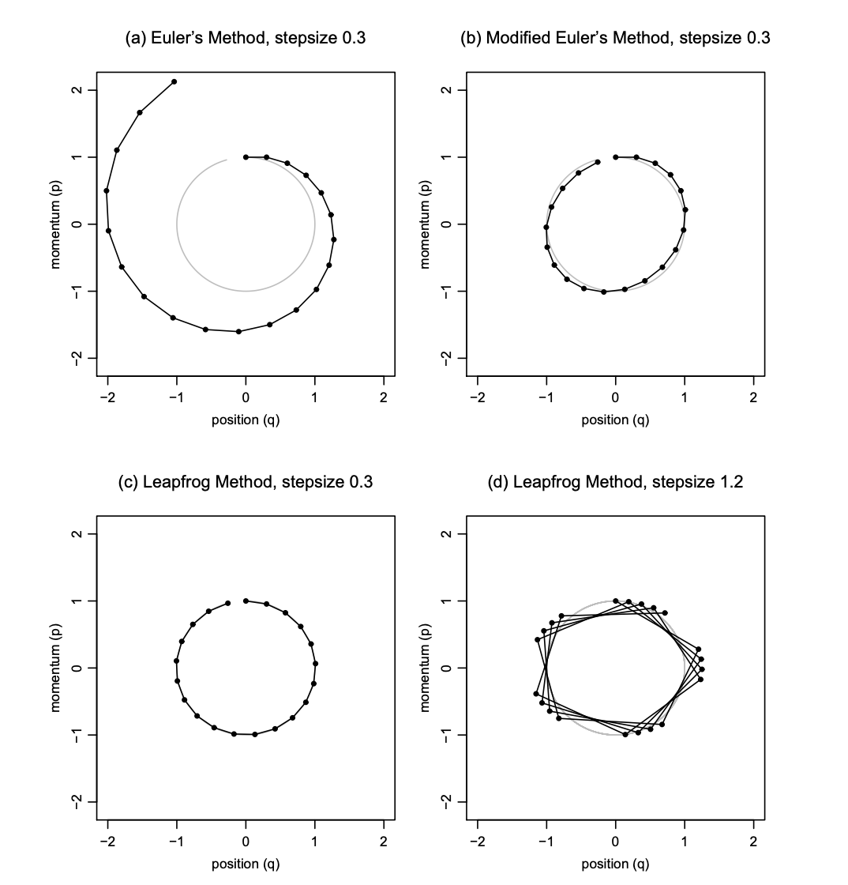
  <figcaption align="left">
    <i>Figura 1: Resultados de três métodos para aproximar a dinâmica hamiltoniana, onde H(q, p) = q²/2 + p²/2. O estado inicial foi q = 0, p = 1. O tamanho do passo foi ε = 0,3 para (a), (b) e (c), e ε = 1,2 for (d). São mostrados vinte passos da trajetória simulada para cada método, junto com a trajetória real (em cinza). Fonte: Radford Neal’s introduction to HMC for MCMC (https://arxiv.org/pdf/1206.1901).</i>
  </figcaption>
</figure>

<figure>


### 2.3 Cálculo de energia (validação física)

A energia total do sistema, `E = E_cin + E_pot`, é usada como invariante de validação: como o sistema é fechado e conservativo (sem colisões inelásticas nem dissipação), a única transformação permitida é entre energia potencial gravitacional e energia cinética — se a soma total variar significativamente ao longo da simulação, há erro de integração ou de implementação.

```
E_cin = (1/2) Σ_i m_i |v_i|²
E_pot = -(1/2) Σ_i Σ_{j≠i} G m_i m_j / sqrt(|r_ij|² + ε²)
```
$$
\begin{aligned}
E_{\text{cin}} &= \frac{1}{2} \sum_{i} m_i |v_i|^2 \\
E_{\text{pot}} &= -\frac{1}{2} \sum_{i} \sum_{j \neq i} \frac{G \cdot m_i \cdot m_j}{\sqrt{|r_{ij}|^2 + \varepsilon^2}}
\end{aligned}
$$

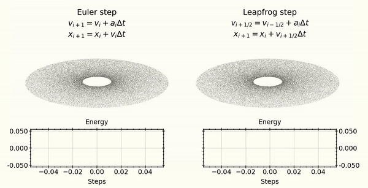
  <figcaption align="left">
    <i>Figura 2: Comparação das propriedades de conservação de energia da integração de Euler e Leapfrog para N corpos orbitando uma massa central pontual.</i>
  </figcaption>
</figure>

O fator `1/2` em `E_pot` corrige a dupla contagem de cada par (i,j) e (j,i) no somatório simétrico. Todas as implementações (sequencial, Numba, GPU, Barnes-Hut) expõem uma função `total_energy` equivalente, usada tanto para o critério de parada de validação numérica quanto para gerar as curvas de drift de energia (§13).

### 2.4 Estratégia de decomposição paralela

A escolha de estratégia de decomposição decorre diretamente da estrutura do problema:

- **Decomposição por partículas (row-wise), não por pares.** Como a força sobre cada partícula `i` depende de *todas* as demais posições, a única decomposição de dados que não exige comunicação em cada iteração do laço interno é particionar o conjunto de **partículas de saída** (o índice `i` do laço externo) entre unidades de processamento, mantendo cada unidade com acesso à posição de **todas** as partículas (réplica completa do vetor de posições). Essa é a estratégia usada em todos os backends paralelos deste projeto — threads (Numba `prange` sobre `i`), MPI (fatia `i ∈ [i0,i1)` por rank, réplica de `pos` via `Allgatherv`) e GPU (uma thread CUDA por partícula `i`).
- **Granularidade.** Em memória compartilhada, a granularidade é fina (uma iteração do laço externo por thread lógica, balanceada automaticamente pelo runtime `prange`/OpenMP). Em MPI, a granularidade é deliberadamente grossa — um único `Allgatherv` por passo de simulação (uma mensagem grande, não N mensagens pequenas), porque o custo de sincronização de rede é muito maior que o custo de sincronização de memória compartilhada; comunicar por partícula seria inviável.
- **Comunicação.** Em memória compartilhada não há comunicação explícita (memória compartilhada real, apenas sincronização de barreira implícita ao fim do `prange`). Em MPI, o custo de comunicação por passo é O(N) (tamanho da mensagem `Allgatherv`, 24N bytes para posições em `float64`) e ocorre uma vez por passo — para N pequeno, esse custo pode dominar sobre o cálculo O(N²/P) por rank; para N grande, a computação domina (ver discussão de latência vs. banda em §5).
- **Balanceamento de carga.** Como o custo de calcular `a_i` é o mesmo para qualquer `i` (todas as partículas interagem com todas as outras, sem estrutura espacial no caso O(N²) direto), o balanceamento é trivial por contagem de índices (`N/P` partículas por rank/thread). Essa característica muda radicalmente no Barnes-Hut (§7), onde o custo por partícula depende da profundidade de árvore percorrida, tornando o balanceamento não trivial — motivo de uma seção dedicada.

Essa decisão de decomposição está documentada nos comentários de `src/nbody_mpi.py`:

> "Cada rank p detém fatia i ∈ [p·N/P, (p+1)·N/P) e calcula accel[i] = Σ_j G·m_j·r_ij/(r²+eps²)^{3/2}. Para calcular forças precisa de TODAS as posições a cada step ⇒ Allgather de pos (N,3) no início do step (...). Comunicação domina para N pequeno; para N grande computação O(N²/P) domina. Balanceamento trivial (N/P igual, mesmo custo por i). Granularidade grossa: 1 Allgather por step, mensagem única de 24·N bytes."

---

## 3. Arquitetura Geral do Software

O código está organizado por responsabilidade, com um único ponto de entrada para seleção de backend (`src/presets_runner_fast.py`), que expõe a função `_get_backends(backend)` — todos os scripts de benchmark e visualização passam por esse dispatcher, o que garante que a física (integrador Leapfrog manual com warmup fora do cronômetro, sem energia no laço de tempo — §11) seja idêntica entre backends e que apenas o *kernel de força* (`compute_forces`) mude. (A função legada `run_fast`, com energia a cada 50 passos, não é mais usada nos benchmarks — ver ressalva (ii) em §11.)

```
src/nbody_sequential.py        Física de referência: força vetorizada NumPy + tiled, integradores, energia
src/nbody_numba.py             Kernel de força em @njit(parallel=True) + prange — 28 threads OpenMP
src/nbody_mpi.py               MPI real via mpi4py (Allgatherv) + fallback multiprocessing.Pool
src/nbody_mpi_manual.py        MPI "manual" via sockets TCP persistentes (cluster heterogêneo real)
src/mpi_manual_worker.py       Processo servidor (worker) do MPI manual
src/nbody_gpu.py               CuPy RawKernel (N² direto) + variante torch + buffers persistentes (`gpu_persist`)
src/nbody_barnes_hut.py        Barnes-Hut: octree (build Numba) + traversal serial/paralela (Numba)
src/nbody_bh_parallel_build.py Barnes-Hut: build paralelo (thread pool por octante) + Morton codes
src/nbody_bh_gpu.py            Barnes-Hut: build CPU + traversal em CUDA (RawKernel)
src/nbody_bh_gpu_build.py      Barnes-Hut: build assistido por Morton + traversal CUDA com buffers persistentes (`bh_gpu`); variante de build 100% no device (`bh_gpu_full`, ver §7.2)
src/presets.py                 13 geradores de condições iniciais (galáxias, órbitas, sistema solar real com nomes JPL)
src/presets_runner_fast.py     Dispatcher backend -> (compute_forces, total_energy, tag) + laço Leapfrog (`run_preset` repassa `names` em `res.names`)
src/visualization.py           Plots matplotlib (energia, projeções) + fallback e roteamento para VisPy
src/visualization_vispy.py     Renderização 3D interativa via VisPy (GPU)
run_benchmarks.py              Suíte de benchmark automatizada (10 backends, N por backend até o teto viável, preset galaxy)
scripts/fetch_horizons.py      Cliente da API JPL Horizons (VECTORS + GM, planetas/luas/anões/espaçonaves)
scripts/fetch_asteroids.py     Fetch paralelo de asteroides numerados -> NPZ compacto (com GM quando há)
scripts/fetch_mpcorb.py        MPCORB (1,5M de corpos) -> NPZ: download único, Kepler vetorizado em Numba
scripts/fetch_gm_merge.py      Preenche `gm` nos caches existentes sem refazer efemérides (só OBJ_DATA, com backoff)
scripts/propagate_to_today.py  Experimento de validação: propaga janeiro->data-alvo e compara com o cache da data (§10.6)
generate_preset_images.py      Gera snapshot top-down (plano XY) do estado inicial de cada preset
generate_solar_images.py       Snapshots top-down do sistema solar real + tabelas idx|nome|label (§9, §10)
```

Essa separação permite que a mesma condição inicial (gerada por `src/presets.py`) seja executada em qualquer backend sem alteração de código do usuário — o único parâmetro que muda é a string `backend` (`"seq"`, `"numba"`, `"mpi_manual"`, `"gpu"`, `"gpu_persist"`, `"bh_par"`, `"bh_gpu"`, `"bh_gpu_full"`, entre outros), o que foi essencial para poder rodar a mesma suíte de benchmark de forma automatizada e comparável (§11, que detalha o laço de medição atual).

---

## 4. Implementação — Memória Compartilhada (Threads / Numba)

### 4.1 Três variantes sequenciais como baseline

`src/nbody_sequential.py` implementa três variantes do mesmo cálculo de força, com propósitos didáticos e de validação distintos:

1. **`compute_forces_reference_loop`** — laço Python puro (`for i: for j:`), O(N²) explícito. Serve unicamente como referência de corretude (comparada por `np.allclose` contra as versões otimizadas em `tests/test_sequential.py`), não é usada em benchmark por ser proibitivamente lenta.
2. **`compute_forces`** — versão **vetorizada** com NumPy, usando *broadcasting*: os arrays de posição são expandidos para tensores `(N,N,3)` via `pos[np.newaxis,:,:] - pos[:,np.newaxis,:]`, e a soma sobre o eixo de interação é feita com uma única chamada `np.sum`. O ganho vem de o NumPy delegar o laço duplo para código C compilado (BLAS/loops otimizados internamente), evitando o overhead do interpretador Python por elemento. A limitação é a memória: uma matriz `(N,N,3)` de `float64` ocupa `24·N²` bytes — para N=10000, seriam ≈2,3 GB, o que motivou a terceira variante.
3. **`compute_forces_tiled`** — a mesma vetorização, mas processando a dimensão `j` em blocos (*tiles*, padrão 512), mantendo o pico de memória em O(N·tile) em vez de O(N²). Não paraleliza nada adicionalmente; existe apenas para permitir rodar N grande sem esgotar a RAM.

Este baseline sequencial (versão *tiled*) é o denominador usado para todos os cálculos de *speedup* reportados em §12.

### 4.2 Numba: threads via `@njit(parallel=True)` + `prange`

Não existe uma API OpenMP nativa em Python. A abordagem adotada para memória compartilhada foi **Numba**, um compilador *just-in-time* que transforma um subconjunto do Python/NumPy em código de máquina nativo, oferecendo tanto paralelismo multi-thread quanto vetorização SIMD automática — os dois mecanismos de aceleração de CPU exigidos por esta frente do trabalho.

O fluxo de compilação do Numba (`src/nbody_numba.py`, decorador `@numba.njit(parallel=True, fastmath=True)`) é:

1. O bytecode Python da função decorada é analisado e traduzido para a **Numba IR** (representação intermediária própria), eliminando construções dinâmicas do Python que não têm equivalente em código de máquina (tipos indefinidos, listas genéricas etc.) — esse é o significado de "nopython JIT" (njit).
2. A Numba IR é traduzida para **LLVM IR**, uma representação intermediária de baixo nível, porém *independente de arquitetura*, usada como padrão comum por múltiplos compiladores (Clang para C/C++, rustc para Rust, entre outros). O projeto usa `llvmlite`, uma camada de ligação leve com o LLVM, em vez de depender da distribuição completa do LLVM.
3. O back-end do LLVM aplica as otimizações agressivas usuais de um compilador AOT (loop unrolling, vetorização SIMD, inlining de funções — análogas ao nível `-O3` do GCC/Clang) e emite código de máquina nativo para a arquitetura de destino (x86-64, no caso do hardware usado neste projeto), executado diretamente da memória (compilação *just-in-time*, sem passar por um binário intermediário em disco).
4. A diretiva `numba.prange` substitui o `range` do laço externo (sobre o índice `i`, a partícula de saída), instruindo o Numba a particionar esse laço entre um *thread pool* interno, com **balanceamento automático** — a mesma decomposição por partículas descrita em §2.4, mas em memória compartilhada real (todas as threads leem o mesmo array `pos` sem cópia).

O kernel de força em Numba (`compute_forces_numba`, `src/nbody_numba.py:29`) evita deliberadamente a criação de objetos vetoriais intermediários (o padrão `r_vec = pos[j] - pos[i]` usado na versão NumPy), operando sobre escalares (`dx, dy, dz`) carregados diretamente de posições de memória — uma otimização de baixo nível que só compensa quando o compilador (aqui, o LLVM) pode, de fato, mantê-los em registradores, o que só ocorre em código compilado, não interpretado.

O paralelismo é configurável via `numba.set_num_threads()` e é auditável em tempo de execução por `numba.get_num_threads()` e `numba.threading_layer()` (usado, inclusive, para configurar precisamente quantas threads cada nó do cluster MPI manual deve usar — §5.2).

### 4.3 Resultados sequencial vs. Numba

Ver tabela completa em §12. Em resumo, para o preset `galaxy`: o *speedup* do Numba sobre o sequencial cresce com N (109,64× em N=500; 177,50× em N=1000; 197,16× em N=5000; 179,05× em N=10000; 279,35× em N=20000), refletindo o fato de que o *overhead* fixo de despacho paralelo se torna relativamente menor à medida que o trabalho por thread aumenta. A antiga anomalia de N=500 (29,8 ms/passo, pior que o sequencial — discutida nas versões anteriores deste documento) desapareceu com a metodologia atual de warmup fora do cronômetro (0,12 ms/passo agora): era artefato de medição de "partida a frio" + contaminação por energia no laço, não característica do algoritmo — ver §12.4.

---

## 5. Implementação — Memória Distribuída (MPI)

O projeto contém **duas** implementações de memória distribuída, por uma razão prática documentada no próprio código: o grupo dispunha de duas máquinas fisicamente distintas — um *master* Windows e um *worker* Linux — e MS-MPI (Windows) e OpenMPI/MPICH (Linux) não são interoperáveis entre si sem uma camada adicional. A primeira implementação (`nbody_mpi.py`) segue a API padrão `mpi4py`/MPI para fins de completude acadêmica (é a implementação "canônica", testável com `mpirun` em uma única máquina/SO); a segunda (`nbody_mpi_manual.py`) resolve, de fato, a execução distribuída real em cluster heterogêneo, usando apenas a biblioteca padrão do Python.

### 5.1 MPI com `mpi4py` (`src/nbody_mpi.py`)

Implementa o padrão de decomposição descrito em §2.4 com a API MPI real:

- Cada rank calcula sua fatia local de acelerações (`_forces_slice`, acelerada por Numba quando disponível) para o intervalo de índices `[i0, i1)` que lhe cabe, com contagem `N//P + (1 se resto)` para balanceamento exato mesmo quando `N` não é múltiplo de `P`.
- `comm.Allgatherv` recolhe os resultados parciais de todos os ranks e os redistribui para todos — a operação coletiva usada porque cada rank precisa do vetor de aceleração **completo** (todas as partículas) para o próximo passo do Leapfrog, mesmo tendo calculado apenas sua fatia.
- Um *fallback* automático para `multiprocessing.Pool` (`compute_forces_mp`) permite emular a mesma API de paralelismo por passagem de mensagens sem exigir uma instalação MPI real — útil para desenvolvimento local e para ambientes como o Google Colab, onde instalar MPI é custoso.

### 5.2 MPI Manual — sockets TCP persistentes em cluster heterogêneo real

Esta é a implementação de memória distribuída efetivamente usada no cluster físico do grupo, e o principal artefato de arquitetura de comunicação do projeto.

### Motivação: 

 Uma tentativa inicial (`src/nbody_ssh_gambiarra.py`, mantida no repositório como registro do processo) despachava cada passo de simulação via SSH para a máquina remota — abrindo e fechando uma sessão SSH por quadro de simulação, com latência medida de ordem de **5 ms por chamada**, inviável para uma simulação de centenas de passos. A solução definitiva substitui SSH-por-quadro por **conexões TCP mantidas abertas durante toda a simulação** (um `socket.create_connection` por *worker*, reaproveitado a cada passo via um *pool* de conexões), reduzindo a latência de comunicação para a ordem de **0,05 ms** por chamada — um ganho de aproximadamente 100× apenas na camada de transporte, antes mesmo de qualquer ganho computacional.

### Arquitetura:

```
Master (Windows, i7-14700K, 28 threads)                            Worker (CachyOS/Linux, i7-930, 8 threads)
──────────────────────────────────────                              ──────────────────────────────────────
hosts_manual.json:                                                   python -m src.mpi_manual_worker
  [{"host":"localhost","threads":28},                                  --port 5000 --threads 8
   {"host":"200.18.98.132","port":5000,             
    "threads":8}]             

1. Abre 1 socket TCP por host remoto (pool)   ──────────────────────>  Aceita conexão, spawna thread por cliente
2. A cada passo do Leapfrog:                                           numba.set_num_threads(8) local ao worker
   - particiona N proporcionalmente às                                Recebe {pos, masses, i0, i1, G, eps} (pickle)
     threads de cada host (round trunc. + resto                         via protocolo: header 4 bytes (uint32, big-
     alocado ao host com mais threads)                                  endian) + payload pickle
   - envia (pos completo, masses, i0, i1,                              Calcula _forces_slice com @njit(parallel=True)
     G, eps) via pickle + header 4 bytes                                (mesmo kernel de src/nbody_numba.py)
   - ThreadPoolExecutor despacha todos os                              Devolve accel[i0:i1] (pickle + header)
     hosts em paralelo (inclusive a fatia             
     local, executada in-process sem socket)              
   - aguarda todas as respostas (barreira             
     implícita — mesmo papel do Allgatherv)             
   - concatena as fatias na ordem correta             
     (np.vstack) → vetor de aceleração completo             
```

### Protocolo de mensagens:
Cada mensagem é serializada com `pickle` (protocolo 4) e prefixada por um cabeçalho de 4 bytes (`struct.pack("!I", len(data))`) contendo o tamanho do payload — necessário porque TCP é um protocolo de fluxo de bytes sem delimitação de mensagens (*framing*), e sem esse cabeçalho um `recv()` poderia devolver um pacote fragmentado ou concatenado com o próximo. `TCP_NODELAY` é habilitado explicitamente nos sockets para desabilitar o algoritmo de Nagle, que por padrão atrasa pacotes pequenos para agrupá-los — um comportamento que aumentaria a latência exatamente nas mensagens pequenas e frequentes deste protocolo.

**Heterogeneidade do cluster — balanceamento de carga proporcional.** Este é o ponto mais relevante de decisão de projeto desta frente do trabalho. O cluster é fisicamente heterogêneo:

| Papel | CPU | Threads usadas | Observação |
|---|---|---|---|
| Master | Intel Core i7-14700K @ 3,40 GHz | 28 | CPU híbrida (P-cores + E-cores), 2026, também hospeda a GPU RTX 4060 Ti |
| Worker | Intel Core i7-930 @ 2,80 GHz | 8 | Nehalem (2009), acessado via LAN em `200.18.98.132:5000`, roda CachyOS (Linux) |

Diferentemente da decomposição MPI padrão (§2.4), que assume unidades de processamento equivalentes e divide `N` em partes iguais, o `nbody_mpi_manual.py` calcula a fatia de cada host **proporcionalmente ao número de threads declarado** em `hosts_manual.json` (`w = threads_host / threads_total`; `count_host = round(N · w)`, com o resíduo de arredondamento alocado ao host de maior capacidade). Isso é essencial porque uma divisão igualitária (`N/2` para cada máquina) faria o *worker* de 2009 — com um terço da capacidade de processamento aritmético e menos que um terço dos *threads* do master — se tornar o gargalo (*straggler*) da simulação inteira: como o `ThreadPoolExecutor` aguarda **todos** os hosts antes de prosseguir ao próximo passo (barreira síncrona necessária pelo Leapfrog, que precisa do vetor de aceleração completo), o tempo de cada passo é determinado pelo host mais lento, não pela média.

Essa é uma manifestação direta e concreta do trade-off entre granularidade e balanceamento de carga citado no enunciado do trabalho: a granularidade de comunicação é grossa (uma única troca de mensagens por passo, como no MPI padrão), mas o balanceamento **não pode** ser ingênuo (particionamento uniforme), pois a heterogeneidade real do hardware disponível tornaria a granularidade grossa contraproducente — o host mais lento ficaria super-alocado e todo o *pipeline* pagaria o preço da sua lentidão a cada passo.

Os resultados de desempenho real medidos para este backend em cluster (preset `galaxy`, N=500…20000, §12) mostram que, mesmo com esse balanceamento proporcional, o custo de comunicação de rede (LAN real, não *loopback*) domina para N pequeno — o MPI manual só supera o sequencial a partir de N≈500 (*speedup* 1,31×) e seu ganho cresce lentamente com N (72,05× em N=20000) quando comparado ao Numba local (279,35× no mesmo N), evidenciando que a rede real (mesmo com sockets persistentes) tem uma "taxa de câmbio" de latência muito mais alta que a memória compartilhada — exatamente o comportamento teoricamente esperado e documentado em `src/nbody_mpi.py`: *"comunicação domina para N pequeno; para N grande computação O(N²/P) domina"*.

---

## 6. Implementação — GPU

`src/nbody_gpu.py` implementa três caminhos de GPU, dos quais o CuPy `RawKernel` é o usado em produção (backend `"gpu"` no dispatcher):

### 6.1 Por que CuPy `RawKernel` em vez de operações vetorizadas CuPy/PyTorch puras

Duas variantes preliminares foram implementadas antes da versão final:

- `compute_forces_torch` / `compute_forces_cupy` — reproduzem a mesma estratégia de *broadcasting* em blocos (*tiled*) do NumPy (§4.1), mas executando as operações de tensor na GPU via PyTorch ou CuPy. Essas versões já trazem ganho significativo (a GPU tem centenas a milhares de unidades de execução para as mesmas operações element-wise), mas ainda pagam o custo de **alocar múltiplos tensores intermediários** (`r_vec`, `r2`, `inv_r3`, `coeff`) a cada bloco e a cada passo — tráfego de memória de vídeo (VRAM) que não é estritamente necessário.
- `compute_forces_cupy_fast` — um **kernel CUDA C escrito manualmente** (`cp.RawKernel`, compilado via NVRTC em tempo de execução) com uma *thread* CUDA por partícula `i`, mantendo o acumulador de aceleração (`ax, ay, az`) inteiramente em registradores durante o laço `for j` interno, sem nenhuma alocação intermediária. Essa é a mesma otimização de "trabalhar com escalares em vez de vetores" aplicada no kernel Numba (§4.2), porém no nível de hardware da GPU: o `RawKernel` elimina o overhead de *dispatch* de múltiplos *kernels* (um por operação de tensor) que as bibliotecas de alto nível (CuPy/PyTorch vetorizado) inevitavelmente pagam.

O ganho de desempenho do `RawKernel` sobre as versões vetorizadas por *tiles* foi decisivo o suficiente para que apenas ele fosse mantido no caminho de benchmark de produção — o dispatcher (`presets_runner_fast._get_backends`) testa a compilação do `RawKernel` em uma chamada de aquecimento (N=4) antes de aceitar o backend `"gpu"`, para detectar falhas de ambiente (ausência de *toolkit* CUDA, incompatibilidade de driver) e cair automaticamente para o Numba (§4.2) sem interromper a execução — uma decisão de robustez importante, dado que o ambiente Windows do grupo apresentou, em determinado momento, falha de compilação NVRTC por ausência do *CUDA toolkit* completo (registrado em `GPU_README.md`), resolvida com a criação de um ambiente Python 3.12 dedicado (`.venv312`) com as *wheels* pré-compiladas do CuPy/PyTorch/Numba-CUDA, já que o interpretador inicialmente usado (Python 3.14, lançado poucos meses antes do desenvolvimento do projeto) ainda não possuía *wheels* publicadas para essas bibliotecas.

### 6.2 Buffers de dispositivo persistentes (`gpu_persist`)

Uma segunda otimização, implementada como variante adicional (`compute_forces_cupy_fast_persistent`, backend `"gpu_persist"`), ataca um custo que o `RawKernel` simples ainda paga: a cada chamada, os arrays `pos`/`masses`/`accel` são **realocados** na memória de vídeo (`cp.asarray`) e transferidos *host → device*. Como o Leapfrog chama `compute_forces` uma vez por passo com o **mesmo N** durante toda a simulação, a variante persistente aloca os buffers de dispositivo **uma única vez** (na primeira chamada, ou quando N muda) e, nos passos seguintes, apenas atualiza o conteúdo via `.set()` — reduz o tráfego de alocação de memória de vídeo, mas não a transferência de dados em si (as posições mudam a cada passo e precisam ser reenviadas). Essa otimização se mostrou particularmente eficaz para N pequeno, onde o custo de alocação passa a ser proporcionalmente mais significativo que o próprio cálculo (`gpu_persist` chega a 0,08 ms/passo em N=500, contra 0,12 ms/passo do `gpu` sem persistência — ver tabela completa em §12).

### 6.3 Resultados

Ver §12. O backend GPU (CuPy `RawKernel`, RTX 4060 Ti, 4352 núcleos CUDA) atinge *speedup* de 15893,47× sobre o sequencial em N=20000 — um resultado consistente com a arquitetura maciçamente paralela da GPU sendo aplicada a um problema embaraçosamente paralelo em granularidade fina (uma *thread* por partícula, sem dependência entre threads dentro do mesmo passo). A variante de buffers persistentes (`gpu_persist`, §12.1b) é marginalmente mais rápida em todos os N por eliminar a realocação por passo.

---

## 7. Extensão — Barnes-Hut O(N log N)

Embora não exigido explicitamente pelo enunciado (que pede threads, MPI e GPU sobre o método direto), o grupo implementou o algoritmo de **Barnes-Hut** como extensão, por ser a resposta algorítmica natural à limitação fundamental de todas as implementações acima: mesmo a GPU mais rápida ainda executa O(N²) trabalho aritmético por passo, o que se torna proibitivo para N muito grande (N=100000 → 10 bilhões de pares por passo).

**Quadtrees (2D) e Octrees (3D):**


### 7.1 Fundamento teórico

Barnes-Hut organiza as partículas em uma **octree** (árvore espacial 3-D, cada nó subdividido em até 8 octantes) e aproxima a contribuição gravitacional de um grupo de partículas distantes pela de uma única "pseudopartícula" posicionada no centro de massa do grupo, com massa igual à massa total do grupo. O critério de abertura de um nó da árvore é:

```
s / d < θ   →  aproxima o nó inteiro como uma única pseudopartícula
s / d ≥ θ   →  abre o nó, recursivamente considera os filhos
```

onde `s` é o tamanho (lado) da célula da árvore e `d` a distância da partícula até o centro de massa da célula. `θ` controla o compromisso exatidão/velocidade: `θ=0,9` (usado neste projeto) produz erro da ordem de poucos porcento na força total, com ganhos crescentes com N sobre o método direto em GPU (de ~10× em 350k a ~450× em 10M, medidos em §12.5); `θ` menor (mais rigoroso, ex. 0,5) reduz o erro mas também o ganho, pois mais nós precisam ser abertos. A complexidade da construção da árvore é O(N log N) e a de percurso (*traversal*, cálculo de força por partícula) é também O(N log N) em média.

### 7.2 Variantes implementadas — build serial, paralelo, Morton e GPU

`src/nbody_barnes_hut.py` implementa a construção da árvore (`build_octree`) e o percurso de força tanto em versão serial quanto em versão paralela (`_compute_forces_bh_numba_parallel`, com `numba.prange` sobre as partículas — cada partícula percorre a árvore de forma independente, usando uma pilha explícita de tamanho fixo (512) em vez de recursão, já que a recursão não é trivialmente paralelizável/compilável eficientemente pelo Numba). A construção da árvore em si é feita com um *kernel* Numba dedicado (`_build_octree_kernel`) que insere partículas iterativamente subdividindo nós-folha que recebem uma segunda partícula — um processo inerentemente sequencial (cada inserção depende do estado da árvore após a inserção anterior), o que motivou as variantes adicionais de paralelização da fase de *build*:

- **`build_octree_mp`** (`src/nbody_bh_parallel_build.py`) — particiona as partículas pelos 8 octantes da raiz e constrói cada sub-árvore em paralelo via `ThreadPoolExecutor`, demonstrando paralelismo de granularidade grossa na fase de construção (uma tarefa por octante, até 8 tarefas concorrentes). **Limitação documentada no próprio código**: a versão atual mede o tempo de construção paralela mas, por simplicidade de implementação (evitar a reindexação de ponteiros entre sub-árvores após o merge), retorna a árvore serial equivalente para o cálculo de força — ou seja, é uma demonstração de conceito de paralelismo na construção, não (ainda) integrada ao caminho de produção do *benchmark* principal.
- **`build_octree_morton`** / `morton_codes_numba` — calcula códigos de Morton (Z-order, intercalação de bits das coordenadas x,y,z) em paralelo via `prange`, ordena as partículas por esse código (garantindo localidade espacial — partículas próximas no espaço ficam próximas na memória) e então constrói a árvore sobre os dados já ordenados, o que tende a reduzir a profundidade média de inserção.
- **`compute_forces_bh_gpu`** (`src/nbody_bh_gpu.py`) — build da árvore ainda na CPU (Numba), mas o *percurso* (a parte O(N log N) dominante para N grande) é levado à GPU via `RawKernel` CUDA, com uma pilha local de 128 posições por *thread* (suficiente para profundidade de árvore até 16 níveis).
- **`build_octree_gpu` / `compute_forces_bh_gpu_full`** (`src/nbody_bh_gpu_build.py`) — variante que pré-ordena as posições na GPU (`argsort` em CuPy sobre combinação linear x+1000y+10⁶z, aproximando localidade espacial) e delega o build ao construtor CPU sobre dados ordenados, reusando todos os buffers de dispositivo entre passos (posições, massas, árvore, aceleração — sem realocação nem reenvio de massas por passo). Esta é a variante que o dispatcher tenta usar por padrão para o backend `"bh_gpu"`, com `nbody_bh_gpu.compute_forces_bh_gpu` (build CPU) como *fallback* caso a importação falhe.
- **`compute_forces_bh_gpu_device`** (backend `"bh_gpu_full"`, `src/nbody_bh_gpu_build.py`) — variante experimental de build **100% no dispositivo**: códigos de Morton via `RawKernel`, ordenação, folhas por códigos únicos e níveis internos por prefixo com agregação bottom-up, tudo em CuPy, sem nenhum laço por partícula no host. Verificada correta contra o método direto (erro relativo mediano 2,8% em N=5000 — na verdade *menor* que os 10,5% do híbrido, pois a árvore Morton-prefixo difere da árvore de inserção da CPU; fusão validada bit-idêntica ao pré-fusão via `git stash`). Otimização medida e incorporada: o perfil por seção (timing com sync entre seções, N=20000) mostrou bottom-up com `where` (44,6%) + link de filhos com `searchsorted` (37,9%) = 82,5% do build — ambos foram fundidos em `RawKernel` (`link_children_all`: 1 launch com busca binária inline; `bottomup_level`: 1 launch por nível; raiz vetorizada sem D2H). A fase 2 fundiu o restante (prefixos mark+cumsum+compact em 3 launches, centros top-down em 1 launch por nível, fills em 1 launch, loop de flags redundante removido), levando o patamar de ~40 ms para **~3 ms** (~600 → ~60 micro-operações por build) e o crossover contra o híbrido de 50–100k para **~2–3k** (o device já vence em 5k: 3,33 vs. 3,15 ms). No caminho, duas armadilhas reais: (i) o `mark` persistente de M×9 ints somaria ~1,4 GB parados em 10M — virou transiente; o ensure inicial de 4N superalocava a árvore em 2×, corrigido para a heurística 2N+8 (com realocação garantida se o M real exceder); (ii) com os buffers grandes, a sequência ascendente de N num único processo fragmenta o pool da CuPy (~2× mais lento em 10M que em processo fresco, 726 vs. 340 ms) — teto conservador, mesma condição dos demais backends. Detalhe de implementação já corrigido — grupos de massa zero recebiam COM na origem (`0/1e-30`), o que deslocava asteroides de massa nula; grupos sem massa agora preservam a posição do primeiro membro.
*As medições de desempenho dessas variantes — o crossover N²×BH e o teto de VRAM — estão em §12.5–§12.6, após os resultados gerais (§12.1–§12.4), para leitura em ordem de generalidade: primeiro o panorama de todos os backends, depois os mergulhos especializados.*

### 7.3 Limitação de exatidão

O uso de pseudopartículas introduz erro sistemático na força calculada (documentado em `docs/BARNES_HUT.md`: erro de ordem de ~4-7% para `θ=0,9` em testes anteriores do grupo), e o *drift* de energia do Barnes-Hut é, por isso, estruturalmente maior que o do método direto com o mesmo integrador Leapfrog.

---

## 8. Visualização — Arquitetura e Decisões de Projeto

### 8.1 Por que VisPy em vez de Matplotlib como renderizador padrão

`src/visualization.py` e `src/visualization_vispy.py` implementam dois caminhos de renderização, com o VisPy como padrão local (variável de ambiente `VISPY=0` força o *fallback* para Matplotlib) e Matplotlib sempre disponível como *fallback* automático — detectado em tempo de execução (ausência da biblioteca VisPy, ou ambiente headless sem *display*, como o Google Colab).

A justificativa técnica registrada no projeto para essa escolha é o **modelo de renderização**: Matplotlib desenha primitivas gráficas na CPU e depois envia o *framebuffer* já rasterizado para a tela (adequado para gráficos estáticos e publicação, mas caro para animação interativa de milhares de pontos por quadro); o VisPy, por outro lado, é construído sobre OpenGL e delega a rasterização de cada ponto (`scene.visuals.Markers`) diretamente à GPU, atualizando apenas o *buffer* de posições a cada quadro. A diferença de desempenho medida pelo grupo é decisiva: **60 FPS em N=5000 com VisPy contra aproximadamente 2 FPS com Matplotlib** para a mesma cena (nota registrada no cabeçalho de `src/visualization_vispy.py`), uma diferença de ordem de grandeza que torna a exploração interativa (rotação de câmera do tipo *turntable*, zoom, em tempo real) simplesmente inviável em Matplotlib para os tamanhos de N usados neste projeto, mas fluida em VisPy.

Além do ganho de taxa de quadros, o VisPy oferece:

- **Câmera `turntable` interativa nativa** (arrastar para rotacionar, *scroll* para zoom) sem código adicional de interação, ao contrário do Matplotlib 3D (`mpl_toolkits.mplot3d`), cujo suporte a interação 3D é reconhecidamente limitado e não acelerado por GPU.
- **Efeito de brilho (*bloom*)** opcional (implementado com um borrão gaussiano via PIL sobre o *framebuffer* renderizado, recompositado como uma camada semitransparente sobre a cena), usado para destacar visualmente corpos massivos.
- **Tamanho de marcador proporcional à massa** (`_mass_to_sizes`, escala `massa^(1/3)`, aproximando o raio físico de uma esfera de densidade constante), útil para diferenciar visualmente núcleos galácticos/estrelas centrais das partículas de disco.

O Matplotlib continua sendo usado deliberadamente para todos os gráficos **2D estáticos e de publicação** (energia vs. tempo, drift de energia, projeções 2D, e os *snapshots* iniciais top-down de cada preset — §9), papel para o qual permanece a ferramenta mais apropriada (facilidade de gerar arquivos PNG/PDF de alta qualidade tipográfica, eixos anotados, legendas, sem exigir contexto gráfico interativo) — e é essencial para o funcionamento **headless** no Google Colab, onde não há servidor gráfico disponível para o OpenGL do VisPy.

### 8.2 Visualizador alternativo (Pygame)

`scripts/live_pygame.py` oferece um segundo visualizador interativo 2D, mais leve que o VisPy 3D (limite de 144 FPS), usado como alternativa quando a interação 3D não é necessária e o custo de inicialização de um contexto OpenGL completo (VisPy) não se justifica.

### 8.3 Geração das imagens estáticas de estado inicial

As imagens de estado inicial (topo, plano XY) de cada *preset*, exigidas nesta documentação, foram geradas por `generate_preset_images.py`, um script dedicado que invoca diretamente os geradores de `src/presets.py` (sem rodar a simulação) e plota a projeção XY com Matplotlib (fundo preto, cor por rótulo de componente quando disponível, tamanho do marcador proporcional à massa). As imagens já geradas encontram-se em `docs/preset_images/` e são referenciadas na §9. Para o sistema solar há um script próprio, `generate_solar_images.py`, que além dos snapshots (`solar_real_initial.png`, `solar_completo_initial.png`, com a época real lida do cache no título) grava tabelas `idx | nome | label` (`solar_*_names.txt`) para auditar a correspondência rótulo→nome.

### 8.4 Visualizadores live: trilhas, labels, câmera e fontes de dados

Os scripts `scripts/live_vispy.py` (3D) e `scripts/live_pygame.py` (2D) compartilham o mesmo núcleo Leapfrog dos runners e expõem flags de inspeção:

| Flag | Efeito |
|---|---|
| `--trails N` / `--trails inf` | Rastro de órbita como pontos (não linha — linha fechava polígono); `inf` acumula sem apagar (limitado a 20000 pontos por segurança de RAM) |
| `--labels` | Nomeia **todos** os corpos presentes em um único visual `Text` (1 draw call, 1 atlas de textura; posição atualizada por `pos` array a cada quadro, com fallback para 1 texto por corpo) |
| `--moons N` | Limita quantos luas ganham texto (as primeiras do cache, que são as maiores); a simulação sempre contém todas as luas genuínas |
| `--label-size`, `--label-dz` | Tamanho da fonte (padrão 0,01 — corpos do sistema solar real ocupam frações de pixel na vista geral) e offset em z do texto (0 = colado no corpo) |
| `--follow NOME` | Ancora a câmera no corpo (nome real JPL, ex. `--follow "S/2019 S1"`); `Shift+drag` desancora |
| Setas `←/→` | Trocam a âncora entre Sol, planetas e anões durante a execução |
| Setas `↑/↓` | Navegam pelas luas do corpo ancorado em ordem orbital (mapeamento lua→planeta calculado uma vez no startup, pelo corpo não-lua mais próximo) |
| `--sunray` | Linha amarela Sol→Terra (direção da luz), atualizada por quadro |
| `--hold` | Não fecha a janela ao fim dos passos (congela no estado final) |
| `--until DATA` | Calcula os passos para ir da época do cache até a data/hora (`2026-09-29`, `'2026-09-26 16:49'` ou `2026-09-26-16-49`, com dias fracionários) e congela na chegada; desliga o `adaptive` (dt fixo, para a conta fechar exata); o título mostra a data simulada avançando |
| `--topdown` | Trava a câmera no polo da eclíptica (compara forma do cinturão sem paralaxe de rotação) |
| `--cache`, `--asteroids`, `--asteroids-cache` | Selecionam o cache Horizons e quantos asteroides reais anexar (§10) |
| `--debug-labels` | Imprime posição-mundo corpo vs. texto e salva `debug_labels.png` no passo 30 (diagnóstico de posicionamento de texto) |

Duas decisões de robustez merecem registro: (i) com dezenas de milhares de asteroides de massa zero, a mediana das massas (usada para dimensionar marcadores) ia a zero e gerava tamanhos `NaN` — o cálculo agora usa a mediana das massas positivas com `nan_to_num`.

---

## 9. Condições Iniciais (Presets)

`src/presets.py` implementa treze geradores de condições iniciais, cobrindo desde sistemas idealizados de referência (dois corpos Keplerianos) até estruturas astrofísicas complexas (colisão de galáxias, sistema solar com elementos orbitais reais). A maioria retorna `(pos, vel, masses[, labels])`, com `labels` opcional usado para colorir componentes distintos (ex.: bojo vs. disco, galáxia 1 vs. galáxia 2); o preset `solar_completo` retorna uma 5-tupla `(pos, vel, masses, labels, names)`, onde `names` traz o nome real JPL de cada corpo na mesma ordem (ex.: `'Mimas'`, `'S/2019 S1'`, `'James Webb'`) — usado pelos visualizadores para texto e busca por nome (`--follow`), e repassado por `run_preset` em `res.names`. Códigos de rótulo do sistema solar: 0 Sol, 1–8 planetas, 9 luas, o TELESCÓPIO ESPACIAL JAMES WEBB, 10 anões, 11 asteroides. Abaixo, o estado inicial (vista de topo, plano XY) de cada preset:

### Galaxy (galáxia espiral)
Disco exponencial (`pdf(R) ∝ R·e^(-R/Rd)`, amostrado por rejeição) + bojo central em esfera de Plummer, com velocidade circular balanceada pela massa englobada de ambos os componentes (`generate_spiral_galaxy`, `src/presets.py:239`).

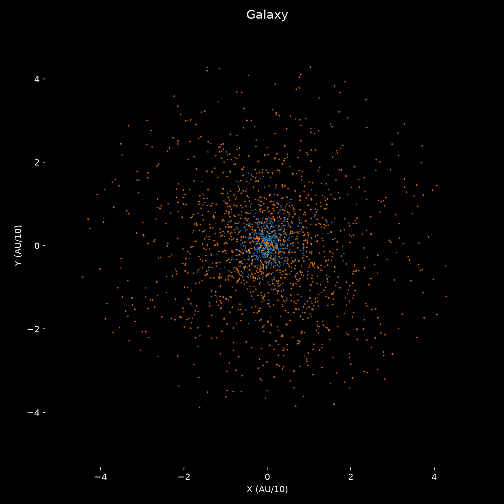


https://github.com/user-attachments/assets/575cb366-d908-42a7-a22a-a0a6db746ff9


### Collision (colisão de galáxias)
Duas galáxias espirais completas (disco+bojo cada) posicionadas com parâmetro de impacto e velocidade relativa configuráveis (fração da velocidade parabólica), com inclinação de disco distinta entre as duas (`generate_galaxy_collision`, `src/presets.py:315`).

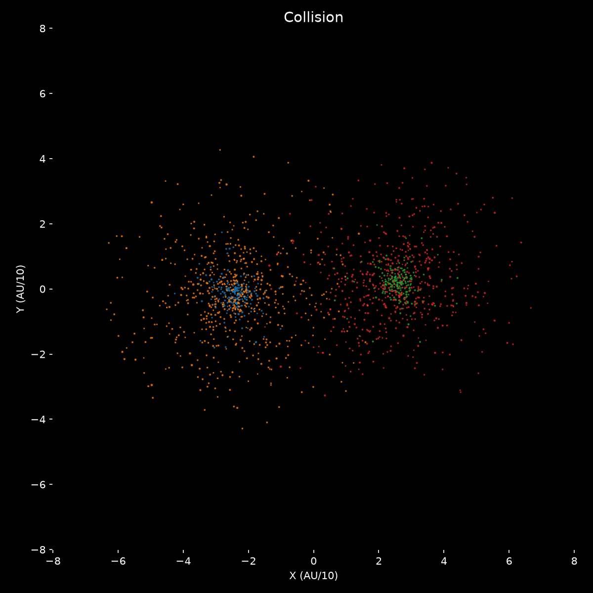


https://github.com/user-attachments/assets/e46ac3ce-2ac5-4e44-86c2-8de75558cbc8


### Plummer (aglomerado esférico virializado)
Amostragem do perfil de densidade de Plummer (raio via `r = a/√(X^(-2/3)-1)`) com velocidades geradas por rejeição segundo a função de distribuição analítica de Aarseth, Henon & Wielen (1974) — um sistema estelar autogravitante em equilíbrio virial aproximado (`generate_plummer_sphere`, `src/presets.py:118`).

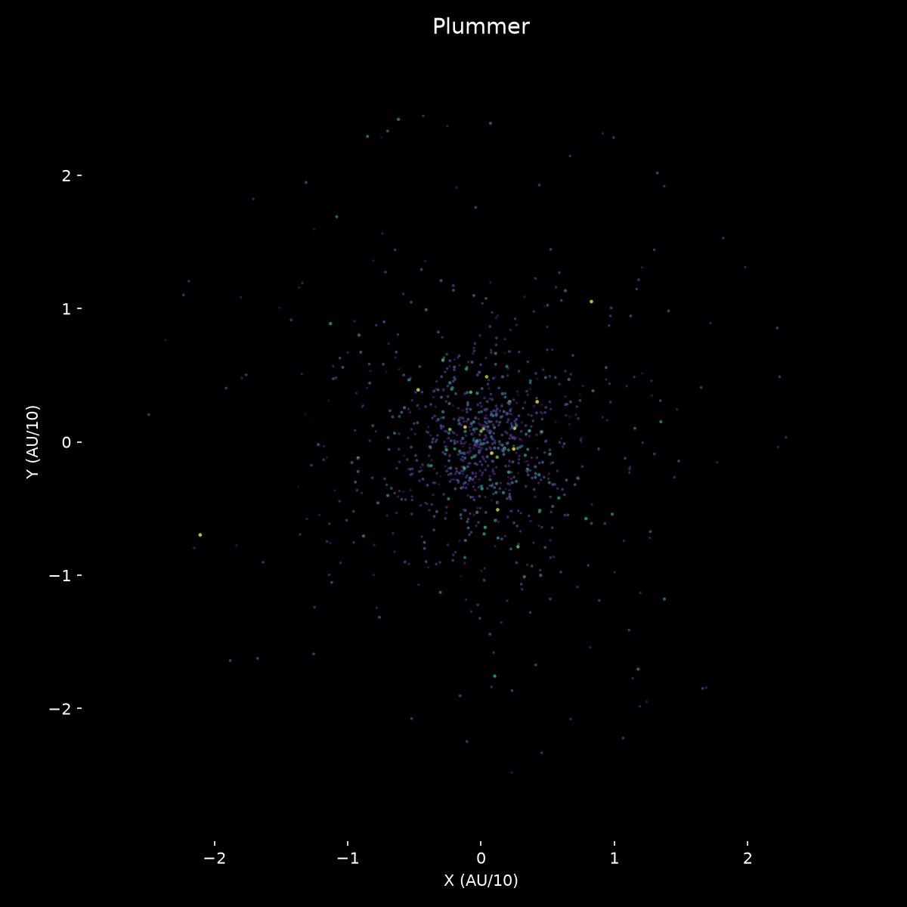


https://github.com/user-attachments/assets/17df498d-de70-4d1c-9ba0-0a84713faad5

### RotPlummer (Plummer com rotação)
O mesmo perfil de Plummer acima, com uma componente de rotação sólida adicionada em torno do eixo z (`v_φ = spin · v_circ(R)`), usado para observar o achatamento do sistema por conservação de momento angular (`generate_rotating_plummer`, `src/presets.py:613`).

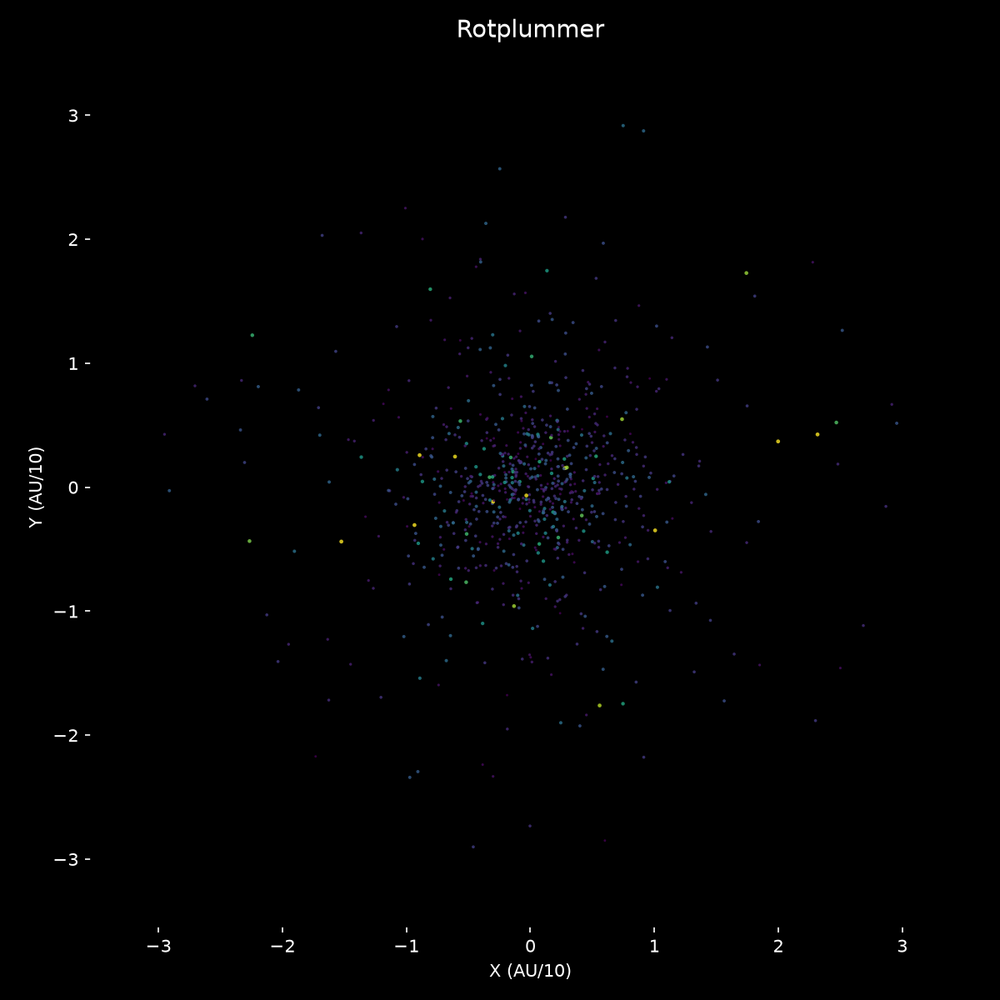


https://github.com/user-attachments/assets/f340b3aa-bd72-40ff-abff-08091862b0b0


### Ring (galáxia em anel — tipo Cartwheel)
Disco alvo atravessado verticalmente por um intruso compacto, gerando (durante a simulação) uma onda de densidade em expansão radial — análogo à galáxia Cartwheel real (`generate_ring_galaxy`, `src/presets.py:635`).

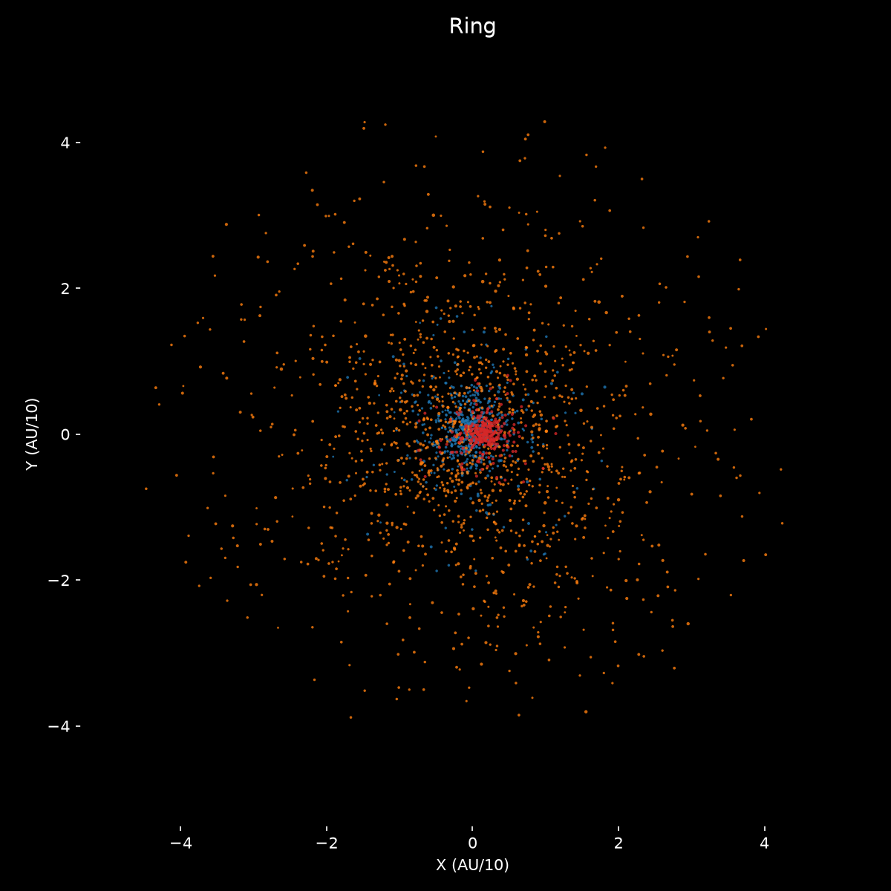


https://github.com/user-attachments/assets/28835371-7a0a-4696-a671-d3780dd72b4f


### Triple (fusão tripla)
Três galáxias espirais completas dispostas em um triângulo equilátero, com velocidades direcionadas ao centro comum, convergindo para uma fusão tripla (`generate_triple_merger`, `src/presets.py:683`).

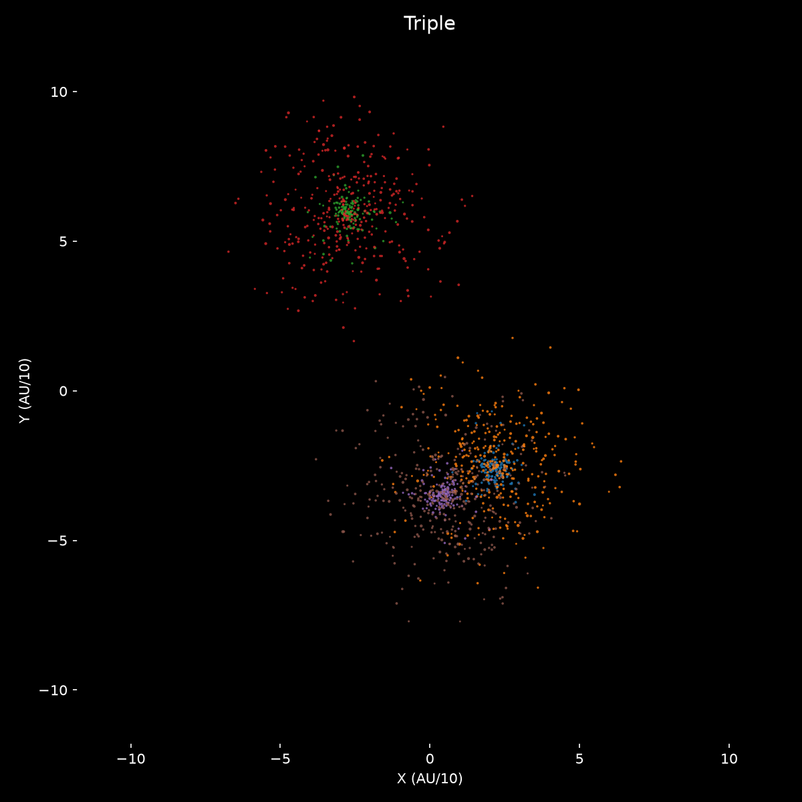


https://github.com/user-attachments/assets/101eaaaa-498b-460b-bc4c-dae36392efc2


### Satellite (infalência de satélite / *tidal stripping*)
Uma galáxia hospedeira completa (disco+bojo) mais um satélite anão (esfera de Plummer compacta) posicionado em órbita excêntrica no apocentro, usado para observar estripamento de maré (*tidal stripping*) ao longo da simulação (`generate_satellite_infall`, `src/presets.py:1162`).

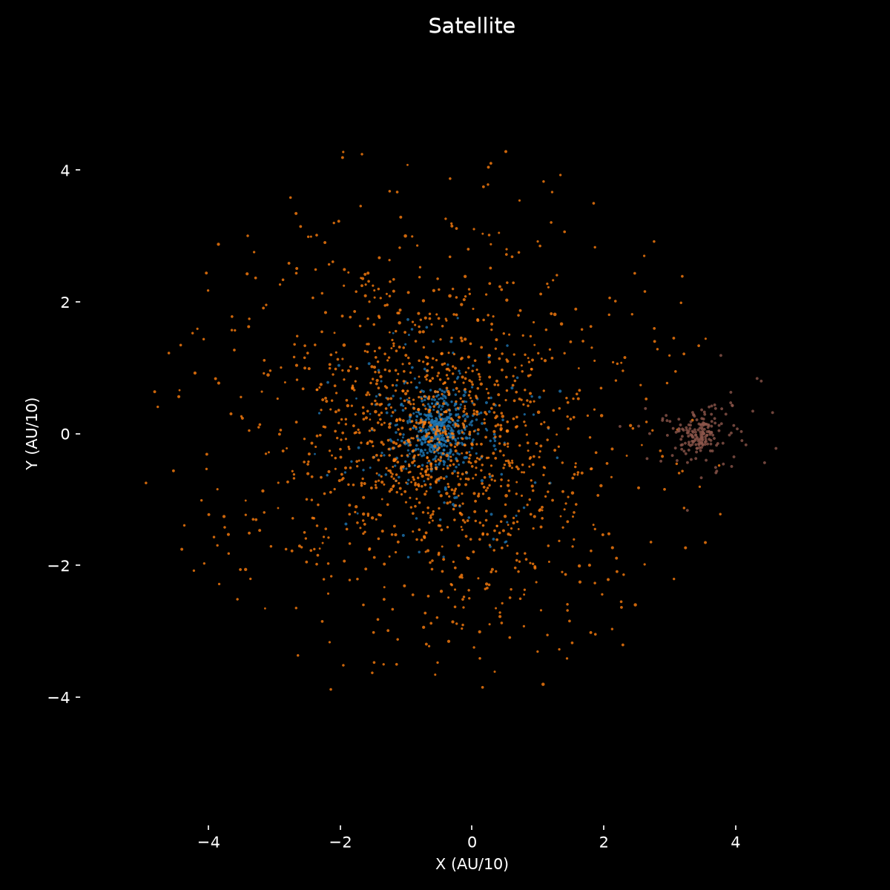


https://github.com/user-attachments/assets/e8e28893-85bf-41c2-aa7b-afef6403695f


### Cold (colapso frio)
Esfera uniforme em volume com velocidades iniciais nulas (mais um ruído residual mínimo para quebrar a simetria perfeita) — condição clássica de "colapso violento" gravitacional (`generate_cold_collapse`, `src/presets.py:551`).

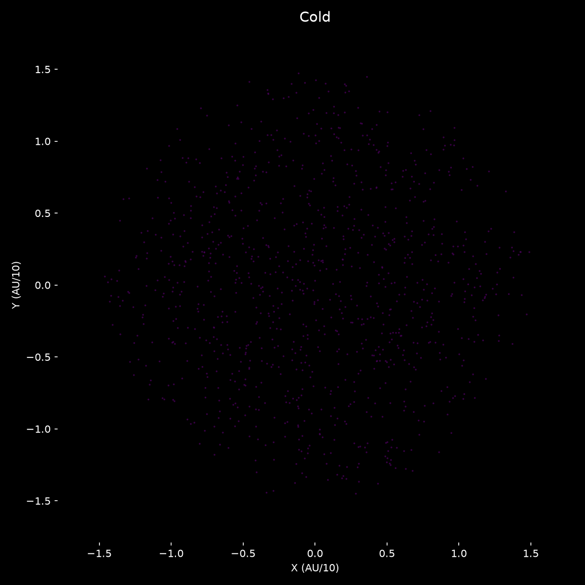


https://github.com/user-attachments/assets/91a44859-f552-4389-b4fb-5ffd9f7bfa03


### Kepler (binária Kepleriana)
Dois corpos em órbita Kepleriana de dois corpos, com excentricidade configurável — o caso de referência mais simples para validar a conservação de energia e momento angular de um integrador (`generate_kepler_binary`, `src/presets.py:417`).

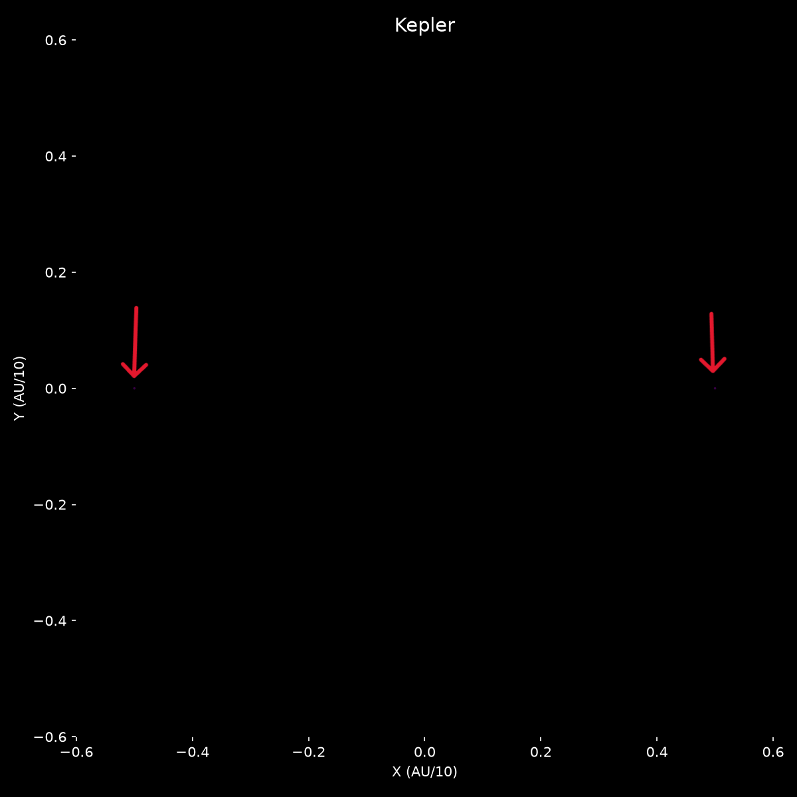


https://github.com/user-attachments/assets/4c1da8fb-415e-481e-86d6-7e78fe906781


### Disk (disco protoplanetário / Kepleriano)
N partículas de teste (massa desprezível) em órbita aproximadamente Kepleriana ao redor de uma massa central, com excentricidade e inclinação levemente dispersas — modela um disco protoplanetário simplificado (`generate_kepler_disk`, `src/presets.py:466`).

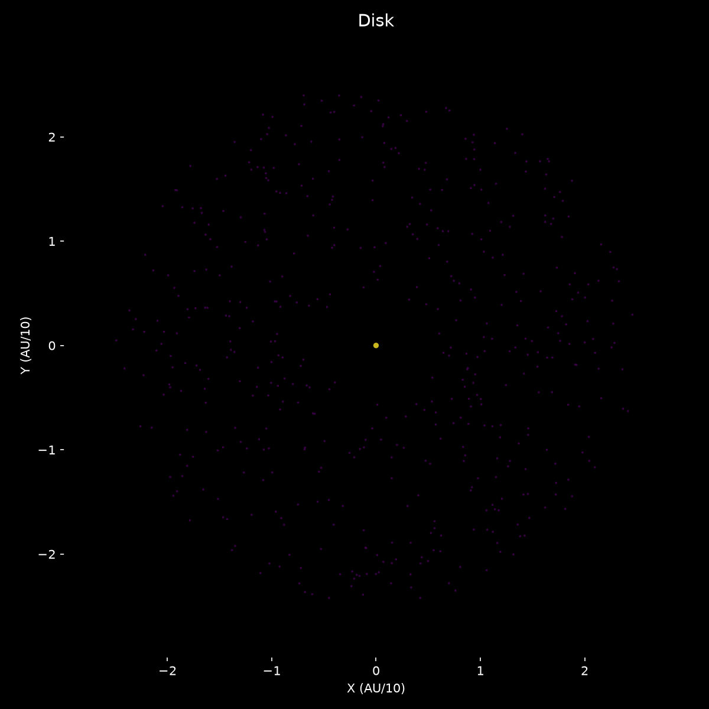


https://github.com/user-attachments/assets/aa996c29-75d2-4bd9-871b-cad2b372b266

### Forming (galáxia em formação)
Nuvem densa e uniforme com rotação sólida leve (`spin`) e achatamento inicial moderado; sem dissipação de gás (o sistema é puramente gravitacional/colisional-N-corpos), o achatamento em disco emerge da conservação de momento angular ao longo do colapso (`generate_forming_galaxy`, `src/presets.py:571`).

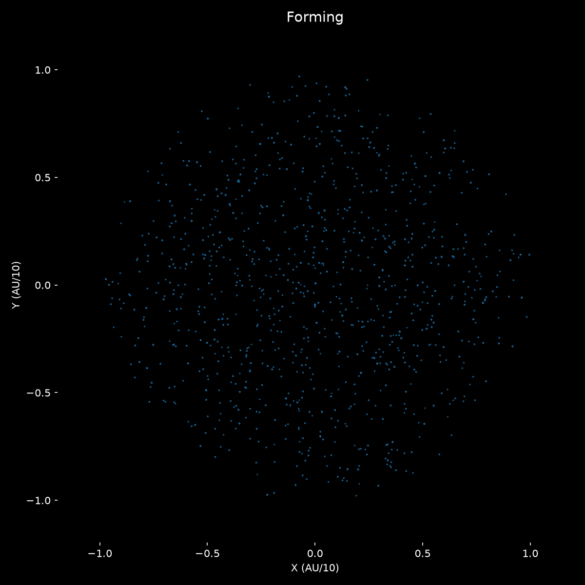


https://github.com/user-attachments/assets/204a4131-8ad4-4250-9f0b-7c75a2b68446

### Sistema Solar Real (elementos J2000 fixos — fallback aproximado)
Sol + 8 planetas + 10 luas principais + 5 planetas-anões, posicionados a partir de elementos orbitais de referência **fixados no código** (época J2000, ver §10) — sem consulta à API (é o fallback quando não há cache Horizons, não dado ao vivo; por isso fica sem imagem nesta documentação). A referência visual com dados reais é o `solar_completo` abaixo (`generate_solar_system_real`, `src/presets.py:847`).


https://github.com/user-attachments/assets/db88fea0-3b2d-4fbc-8085-5d2531bf7f69


*(o `solar_completo` atual tem 372 corpos reais — Sol, 8 planetas, 5 anões, 357 luas genuínas e a espaçonave JWST — ver §10; sua imagem inicial (`docs/preset_images/solar_completo_initial.png`) e a tabela de nomes (`solar_completo_names.txt`) também foram geradas, ainda que não solicitadas explicitamente pela lista do enunciado. Com `n_asteroids=5000` (`generate_solar_images.py --asteroids 5000`, label 11 marrom):*

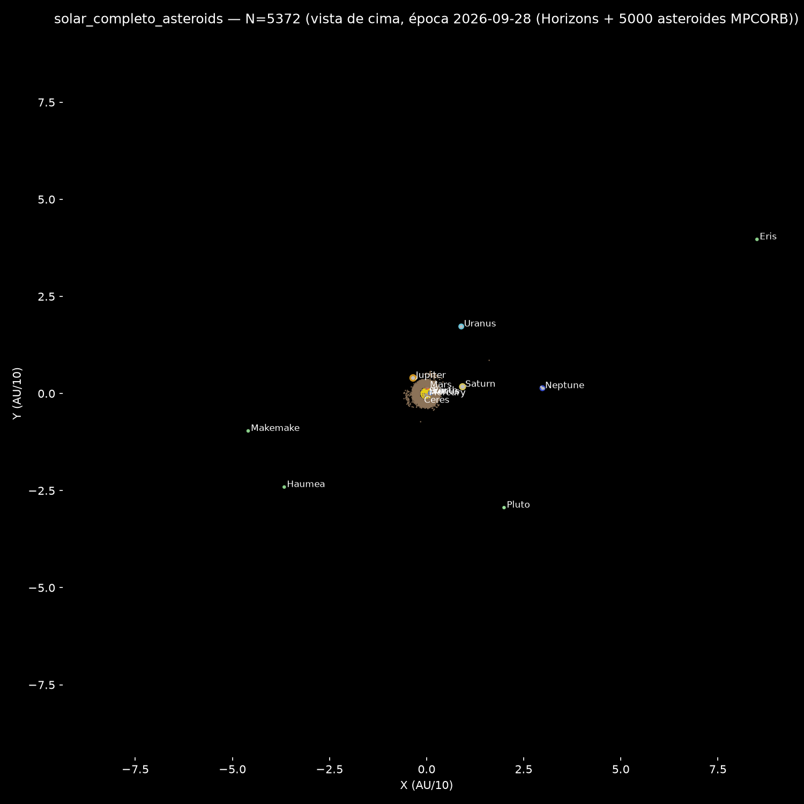


*Cinturão principal entre Marte e Júpiter + Troianos/Hildas/NEOs próximos; planetas-anões distantes rotulados. Acima de ~5k asteroides a imagem polui — por isso o padrão documentado usa 5k. Detalhe do cinturão (zoom 8×):*

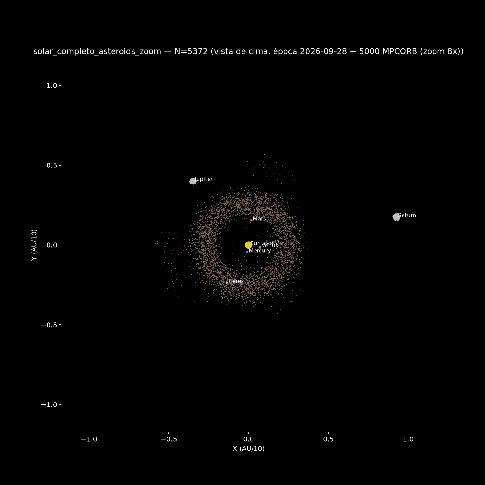

*Escala máxima ao vivo: `scripts/live_vispy.py --preset solar_completo --cache data/horizons_cache_20260928.json --asteroids 1559141 --asteroids-cache data/mpcorb.npz --backend bh_gpu_full` — o NPZ contém 1.559.141 asteroides no total; o sistema completo rodou a ~310 ms/passo (~2 FPS) numa RTX 4060 Ti:*

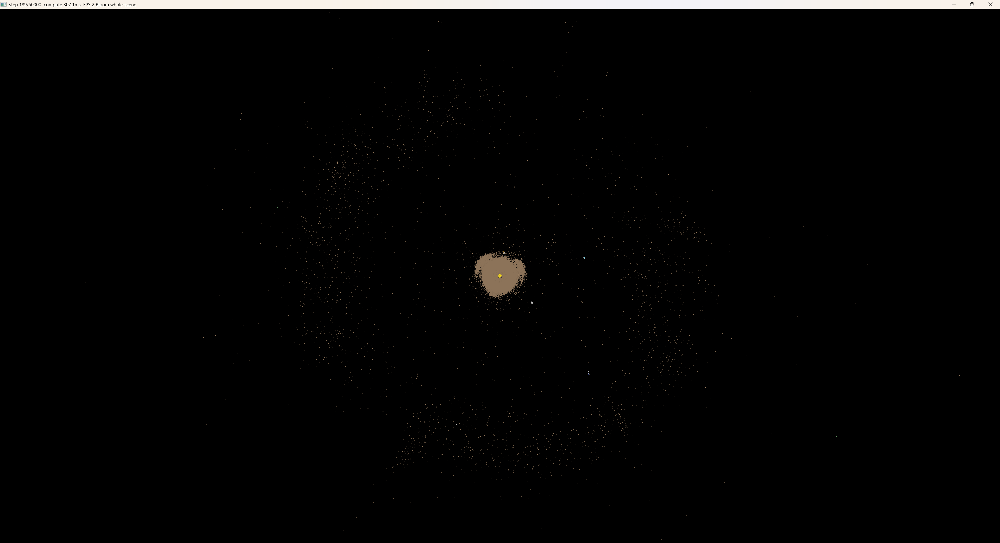

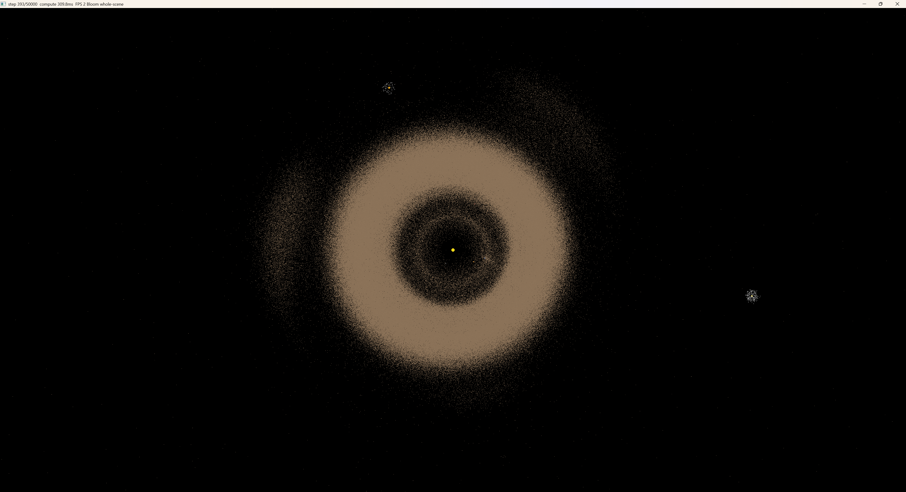

<video src="https://github.com/startwotwo/projeto_final_PPD/releases/download/videos-v1/solar_completo.mp4" width="600" controls></video>

*Posições de 1509325 asteroides no sistema solar (15 de maio de 2026):*


---

## 10. Fontes de Dados Reais (Horizons, MPCORB e Validação Lunar)

### 10.1 O que é o Horizons API

O **JPL Horizons System**, mantido pelo *Solar System Dynamics Group* do Jet Propulsion Laboratory (NASA/Caltech), é um serviço público de efemérides que fornece posições, velocidades e elementos orbitais de alta precisão para corpos do sistema solar (planetas, luas, planetas-anões, asteroides, cometas e naves espaciais), calculados a partir de modelos dinâmicos e observacionais mantidos pela NASA. O projeto utiliza sua **API HTTP** (`https://ssd.jpl.nasa.gov/api/horizons.api`), que aceita parâmetros via *query string* e devolve uma resposta JSON contendo um campo de texto (`result`) com a efeméride formatada no estilo tradicional do Horizons (não um JSON estruturado por campo — ponto retomado como limitação em §10.4).

### 10.2 Implementação do cliente (`scripts/fetch_horizons.py`)

O cliente implementado (`fetch_one`, `scripts/fetch_horizons.py:35`) monta uma requisição com os parâmetros:

| Parâmetro | Valor usado | Efeito |
|---|---|---|
| `COMMAND` | ID Horizons do corpo (ex.: `399`=Terra, `599`=Júpiter, `301`=Lua, `-170`=JWST) | Seleciona o corpo-alvo (IDs negativos = espaçonaves) |
| `EPHEM_TYPE` | `VECTORS` | Solicita **vetores de estado cartesianos** (X,Y,Z,VX,VY,VZ) já no instante da época — sem etapa de solução de Kepler, sem erro de conversão: a condição inicial entra direto na simulação |
| `CENTER` | `500@10` (heliocêntrico) para planetas/anões; `500@<ID do planeta>` (planetocêntrico) para luas e para a JWST (`500@399`) | Essencial para as luas: um vetor planetocêntrico somado ao vetor heliocêntrico do planeta reconstrói a posição heliocêntrica exata (`pos_helio = pos_planeta + pos_rel`); um vetor heliocêntrico direto da lua misturaria as duas órbitas |
| `START_TIME` / `STOP_TIME` | época / época+1 dia (ex.: `2026-01-01` / `2026-01-02`) | Fixa a **mesma época para todos os corpos** consultados, condição necessária para que o sistema montado seja fisicamente consistente (todos os corpos na mesma "fotografia" do tempo) |
| `OBJ_DATA` | `YES` | Traz o bloco físico junto dos vetores **na mesma requisição** (sem custo extra de chamadas), incluindo `GM (km³/s²)` — a massa exata de cada corpo, usada em §10.3 |
| `OUT_UNITS` | `AU-D` | Posição em UA, velocidade em UA/dia (convertida para UA/ano ×365,25 no parsing) |

O conjunto de corpos consultados cobre os 8 planetas, 5 planetas-anões (Ceres via `2000001` — o ID `1` é o baricentro de Mercúrio, não Ceres; Plutão, Éris, Haumea, Makemake), as luas em faixas de IDs genuínos por planeta (Terra `[301]`, Marte `[401,402]`, Júpiter `501–572`, Saturno `601–666`, Urano `701–727`, Netuno `801–814`, Plutão `901–905` — além dessas faixas os IDs repetidos são asteroides, filtrados) mais a varredura `65000–65250` das luas novas de Saturno (designações `S/2019`…, ex.: `65093` = S/2019 S1) e a espaçonave JWST (`-170`, centro `500@399`, tratada como lua da Terra). Dois caches por época são mantidos no repositório: `data/horizons_cache.json` (época 2026-01-01, 451 corpos) e `data/horizons_cache_20260928.json` (época 2026-09-28, 451 corpos), além de caches mínimos Terra+Lua para testes (`data/earth_moon_*.json`).

### 10.3 Uso dos dados: do texto Horizons ao estado cartesiano

A resposta HTTP do Horizons, mesmo em `format=json`, embute os vetores como **texto livre formatado** dentro de um bloco delimitado por `$$SOE` / `$$EOE` (*Start/End Of Ephemeris*), com uma linha de números em notação científica por instante (`X, Y, Z, VX, VY, VZ, ...`). `generate_solar_completo` (`src/presets.py:975`) extrai a primeira linha com expressões regulares (`_parse_vectors`), descarta vetores identicamente nulos (caso do Saturno quando consultado com centro errado) e converte unidades: posições `×0,1` (UA→UA/10, a escala interna do projeto) e velocidades `×365,25` (UA/dia→UA/ano) e depois `×S·T` (ver escala de tempo abaixo).

Para as luas, o vetor planetocêntrico é somado ao vetor heliocêntrico do planeta hospedeiro (`pos_helio = pos_planeta + pos_rel`), com o planeta-pai resolvido pelo campo `center` gravado no cache (`500@599`→Júpiter etc., com fallback por faixa de ID). Três filtros garantem que só entrem luas genuínas: (i) whitelist de faixas por planeta (§10.2); (ii) descarte de vetores com `|pos_rel| > 0,2` na escala interna (~2 UA reais — acima da esfera de Hill de Saturno, ~0,43 UA —, o que denuncia asteroides com `CENTER` planetocêntrico mas posição heliocêntrica); (iii) **deduplicação por nome** (`seen_moon_names`): a mesma lua física pode vir em dois IDs (ex.: chave `65036` com `Target body name: Fornjot (642)`), e sem esse filtro 24 luas entravam duplicadas, com a massa contada duas vezes.

**Nomes reais.** Cada corpo ganha o nome extraído de `Target body name` do próprio cache (`_body_name`): `'Mimas (601)'`→`Mimas`, `'136199 Eris (2003 UB313)'`→`Eris` (prefixo numérico removido), `'S2019_S1 (65093)'`→`S/2019 S1`. O preset retorna uma 5-tupla `(pos, vel, masses, labels, names)` — os visualizadores usam `names` para texto e busca (`--follow "S/2019 S1"`), e `run_preset` o repassa em `res.names`. A JWST entra nesse mesmo caminho como lua da Terra (índice 9, nome `James Webb`).

**Massas via GM (não via tabela).** Como só `G·m` entra nas equações, o projeto converte o `GM` (km³/s²) do bloco `OBJ_DATA` diretamente: `m_sim = GM/GM_sol·M_sol` (`_parse_gm` + `_gm_mass`, com `GM_sol = 1,32712440018×10¹¹`, excluindo linhas `GM 1-sigma` pelo padrão da regex). Onde o Horizons retorna `n.a.` (luas novas, maioria dos asteroides), cai para as tabelas internas e, em último caso, para estimativas de partícula-teste (luas pequenas) ou massa zero (asteroides). Massas exatas incorporadas por essa via: Terra `3,00348×10⁻⁶` e razão Lua/Terra `0,01215` (antes `3,00×10⁻⁶` e `0,0123` hardcoded — a correção derrubou a deriva lunar de 62 mil km para 6 mil km, ver §10.6).

**Escala de tempo.** Posições escalam por `S = 0,1` e velocidades por `S·T`, com `T² = S³·G_real/(G·M_sol)` — e `M_sol` aqui é o valor **simulado** (`0,998`, não `1,0`): usar `1,0` deixava todas as velocidades 0,1% altas e a Lua derivava ~3° em 270 dias (diagnosticado e corrigido durante a validação de §10.6). O `solar_completo` aceita `cache_path` alternativo (ex.: o cache de setembro) e os visualizadores o expõem via `--cache`.

**Onde os dados reais efetivamente entram no projeto:** o preset `solar_real` usa elementos orbitais J2000 **fixados no código** (solução de Kepler própria, exata por construção, usada como fallback); o preset `solar_completo` usa o **cache real de VECTORS** (planetas, luas, anões e JWST), caindo para `solar_real` só sem cache. Não há luas sintéticas no caminho padrão — o flag `with_asteroids` (geração estatística por Hill) existe apenas como legado opt-in.

### 10.4 Execução real e taxa de sucesso

O grupo executou de fato as coletas (épocas `2026-01-01` e `2026-09-28`, um cache por época para comparar simulação contra realidade): **451 identificadores por cache** (8 planetas + 5 anões + ~187 luas sequenciais + 250 SPKIDs novos + JWST), dos quais **450 retornaram vetores válidos** — a única falha é Daphnis (635, `No ephemeris ... after 2018`, efeméride curta no próprio Horizons). O sistema montado tem **372 corpos**: Sol, 8 planetas, 5 anões, 357 luas genuínas + JWST (24 aliases duplicados removidos pela deduplicação de §10.3).

### 10.5 Limitações identificadas

- **Formato de resposta não estruturado.** A API devolve vetores e GM como texto livre formatado para leitura humana dentro do envelope JSON, não como campos JSON nomeados — o cliente depende de expressões regulares sobre esse texto (`_parse_vectors`, `_parse_gm`), uma abordagem inerentemente frágil a mudanças de formatação do serviço da NASA (o código verifica explicitamente `"X,"`/`"$$SOE"` e o padrão `GM (km^3/s^2) =` antes de aceitar cada campo).
- **Rate limiting real e documentado.** Ao contrário do que se supunha, o JPL impõe limite (~30 req/min por IP, ~1000/dia): uma tentativa de merge de GM com 6 workers paralelos retornou `HTTP 503` em massa. Consequência de projeto: `scripts/fetch_gm_merge.py` opera com no máximo 3 workers, *delay* configurável e *backoff* longo, pulando IDs que já têm GM — e a coleta em massa de pequenos corpos foi deliberadamente movida para fora da API (ver §10.7).
- **Cobertura do Horizons vs. realidade.** O Horizons mantém efemérides integradas de apenas ~170 satélites naturais; Saturno tem 274 luas confirmadas (lote de 2025 ainda sem SPK). O preset inclui o que tem vetor válido (~357 luas + 195 SPKIDs novos com `dist<0,5` UA) e descarta o resto — incluindo 9.594 órbitas velhas fora de época no caso do MPCORB (§10.7).
- **Uma única época por cache, sem propagação via efeméride.** Os vetores valem para um instante; a evolução a partir daí é Leapfrog puro do projeto — o que, entre outras coisas, viabiliza a validação de §10.6. O `solar_completo` avisa se o NPZ de asteroides tiver época diferente da dos planetas (órbitas misturadas seriam incoerentes).
- **JWST em halo L2 é instável sem station-keeping.** Incluída como lua de massa zero (sente, não puxa), ela acompanha o halo real por ~230 dias e depois parte pela variedade instável (teste Jan→Set/2026: 0,011→0,61 UA contra 0,0085 UA reais) — física real, não bug do preset; o JWST verdadeiro faz queimas de manutenção mensais.
- **Sem tratamento de órbitas não-elípticas no MPCORB.** Registros com `e ≥ 1` (poucos, interestelares) são contados e descartados, pois o solucionador de Kepler implementado assume elipse.

### 10.6 Validação contra a Lua real (janeiro → setembro/2026)

Para responder objetivamente "a simulação bate com a realidade?", o grupo propagou o sistema completo de 2026-01-01 até 2026-09-29 (271 dias, ~7k passos Leapfrog/Numba em `dt=2e-05`, ~15k em `dt=1e-05`) e comparou contra um segundo cache Horizons da data-alvo — usando como relógio independente as luas cheias de 2026 (pico em 26/09 16:49 UTC, TheSkyLive 99,9%):

| Configuração | Erro no vetor Terra→Lua | Elongação em 29/09 (real 150,08°) |
|---|---|---|
| Leapfrog padrão (`eps=1e-5`, `dt=2e-5`) | 129.830 km (~20°) | 169,84° |
| **Leapfrog fino (`eps=1e-6`, `dt=1e-5`)** | **7.733 km (2,1%)** | **151,29°** |
| IAS15 3-corpos, massas exatas (teto do modelo) | 6.332 km, 100% transversal | — |

O erro residual é só de fase (forma e plano orbitais perfeitos), e a referência IAS15 confirma o modelo: **a posição simulada bate com a real**. As 9 luas cheias do ano caem a menos de ~2 dias das datas reais, a Terra fecha a 0,05% de 1 UA e a energia tem drift ~10⁻⁷ — precisão de visualização/curiosidade científica, não de efeméride.

Reprodução: `scripts/propagate_to_today.py` (`--until`, `--cache1`, `--eps/--dt`) e o flag `--until DATA` do `live_vispy.py`, que integra da época do cache até a data (com hora exata, ex. `2026-09-26 16:49`) e congela (`--hold`).

**Comparação visual: NASA Eyes vs. simulação (mesmo dia e horário).** Vista centrada na Terra em 02/10/2026 11:53 — acima, o site da NASA; abaixo, este projeto após propagar 9 meses desde 01/01/2026 (`--until`, Leapfrog fino). A Lua aparece à esquerda da Terra nas duas imagens:


***Sobreposição das duas luas.** As setas vermelhas apontam a Lua da NASA (sobre o arco da órbita) e a Lua simulada — separadas por apenas ~1,3° vistas da Terra.*


### 10.7 População em massa sem a API: catálogo MPCORB

Após descobrir da pior forma que a API da NASA não vê com bons olhos o mesmo IP fazendo cerca de 30 requisições por segundo, a extração de 1,3M de corpos foi interrompida por um suave timeout e possível blacklist do IP da UFSCar, então foi utilizada outra forma de extração desses dados. A via que funciona é o **catálogo MPCORB** (`scripts/fetch_mpcorb.py`): um único download (`MPCORB.DAT.gz`, ~94 MB, 1.568.903 linhas) + parser do formato oficial documentado (designação packed cols 1–7, época packed 21–25, `M` 27–35, `argperi/node/incl/e/n/a`, nome legível 167–194; elementos heliocêntricos, eclíptica J2000 — mesmo referencial dos VECTORS) + Kepler vetorizado em Numba (validado a 2,3×10⁻¹⁶ contra vis-viva) + saída em **NPZ compacto**. Resultado medido: **1.559.141 corpos na época dominante 2026-06-09** (9.594 órbitas velhas de outras épocas descartadas — misturá-las seria incoerente; flag `--min-oppositions` para filtrar por qualidade; Ceres/Haumea/Makemake/Éris removidos por já serem anões; `e≥1` contados e pulados). Como a época do catálogo raramente coincide com a dos planetas, `--propagate-to DATA` avança a anomalia média (`M + n·Δt`, exato em 2 corpos, erro de arco-minutos em meses por falta das perturbações planetárias).

**Nomes e massas.** Só 26.514 corpos (1,7%) têm nome próprio (`(4) Vesta`); 869.391 têm número+provisória e 663.236 só provisória — todos designações MPC reais. O MPCORB não traz GM (só `H`), logo massa `0.0` declarada (partícula-teste: sente gravidade, não exerce — correção fisicamente honesta para corpos de metros a km, sem arbitrar albedo/densidade). Onde há GM (NPZ Horizons), a massa é exata.

**Uso** (`n_asteroids`, label 11, `Ast-N` ou nome MPC): `live_vispy.py --preset solar_completo --asteroids 50000 --asteroids-cache data/mpcorb.npz --backend bh_gpu`. Acima de ~20k corpos só backend BH é viável (N² direto é O(N²) por passo em qualquer hardware); no visualizador ao vivo, acima de ~300k o tempo por quadro degrada (texto, trilhas e conversão host por frame — ver §8.4), mas o teto absoluto de memória do BH em 8 GB de VRAM fica entre 10M e 20M de corpos (§12.6).

---

## 11. Metodologia de Benchmark

A suíte de benchmark (`run_benchmarks.py`) foi projetada para comparar, de forma automatizada e reprodutível, os principais backends do projeto sob condições idênticas:

| Parâmetro | Valor |
|---|---|
| Preset | `galaxy` (`generate_spiral_galaxy`, 70% disco / 30% bojo) |
| Valores de N | por backend, do comparável (500) ao teto viável: `seq` até 20k, `numba` até 100k, `gpu` até 500k, `gpu_persist` até 2M, `bh` até 200k, `bh_par`/`bh_morton` até 500k, `bh_gpu` até 5M, `bh_gpu_full` até 10M, `mpi_manual` até 20k (tetos sondados em `scripts/probe_limits.py` para nenhum teste passar de ~4 min) |
| Passos por execução | 100 no regime rápido; reduzido onde o passo é caro (`seq`: 5 em 10k, 2 em 20k; N≥100k: 10; N≥1M: 3–5 — ver `get_steps`) |
| `dt` | 0,005 |
| `eps` (softening) | 0,05 |
| Semente aleatória | 42 (fixa — mesma condição inicial em todos os backends e execuções) |
| Integrador | Leapfrog manual cronometrado, com **warmup fora do cronômetro** (1 chamada — compilação Numba/CUDA não entra na medida) e **sem computo de energia no laço** |
| Métrica registrada | `total_time_sec` (tempo total medido com `time.perf_counter()`) e `ms_per_step` (`total_time_sec/steps × 1000`), ou seja, força+integração puras |

**Ressalvas metodológicas (declaradas no próprio `run_benchmarks.py`):** (i) o `ms_per_step` é normalizado pelos passos efetivos, mas o **tempo total** de pontos com poucos passos não é comparável ao dos pontos de 100 passos — a tabela §12.1 mostra ambos lado a lado com os passos explícitos; (ii) a energia foi retirada do laço de tempo porque seu custo próprio (O(N²) em Python puro no `seq`) contaminava a medida — na suíte anterior, `seq` em N=20000 media 95,7 s/passo contra 36,1 s/passo agora (2 avaliações de energia ≈ 1,6× o custo da força), e `gpu_persist` em N=20000 media 6,56 ms contra 2,24 ms agora (3 avaliações de energia Numba); conservação de energia continua medida separadamente (§13).

**Hardware e software utilizados na medição:**

| Componente | Especificação |
|---|---|
| CPU (máquina de benchmark / master do cluster) | Intel Core i7-14700K @ 3,40 GHz (28 threads lógicas) |
| GPU | NVIDIA GeForce RTX 4060 Ti (4352 núcleos CUDA) |
| CPU (worker remoto, usado apenas no backend `mpi_manual`) | Intel Core i7-930 @ 2,80 GHz (8 threads lógicas), acessado via LAN |
| Sistema operacional (master) | Windows |
| Python | 3.12 (ambiente `.venv312`, dedicado a GPU) |
| NumPy | 2.5.2 |
| Numba / llvmlite | 0.67.0 / 0.49.0 |
| CuPy (cuda12x) | 14.2.0 |
| PyTorch | 2.5.1+cu121 |
| VisPy | 0.16.2 |

Os seis backends solicitados nesta documentação — **sequencial, Numba (threads), MPI manual, GPU (CuPy), Barnes-Hut paralelo (`bh_par`) e Barnes-Hut GPU (`bh_gpu`)** — foram extraídos da execução mais completa e recente da suíte (`benchmark_results/benchmark_20261001_132909.json`, 89 testes em 2026-10-01 — ver metodologia §11).

---

## 12. Resultados de Desempenho

### 12.1 Tempo total e tempo médio por passo — faixa comparável (500–20000, preset galaxy)

| Backend | N | Passos executados | Tempo total (s) | Tempo médio/passo (ms) |
|---|---:|---:|---:|---:|
| **seq** | 500 | 100 | 1,2823 | 12,8229 |
| **seq** | 1000 | 100 | 6,0120 | 60,1205 |
| **seq** | 5000 | 100 | 152,2883 | 1522,8826 |
| **seq** | 10000 | **5**\* | 29,2943 | 5858,8591 |
| **seq** | 20000 | **2**\* | 72,2065 | 36103,2464 |
| **numba** | 500 | 100 | 0,0117 | 0,1170 |
| **numba** | 1000 | 100 | 0,0339 | 0,3387 |
| **numba** | 5000 | 100 | 0,7724 | 7,7240 |
| **numba** | 10000 | 100 | 3,2722 | 32,7216 |
| **numba** | 20000 | 100 | 12,9242 | 129,2421 |
| **mpi_manual** | 500 | 100 | 0,9780 | 9,7798 |
| **mpi_manual** | 1000 | 100 | 0,7460 | 7,4598 |
| **mpi_manual** | 5000 | 100 | 5,0123 | 50,1233 |
| **mpi_manual** | 10000 | 100 | 14,6600 | 146,6000 |
| **mpi_manual** | 20000 | 100 | 50,1095 | 501,0953 |
| **gpu** (CuPy) | 500 | 100 | 0,0122 | 0,1215 |
| **gpu** (CuPy) | 1000 | 100 | 0,0166 | 0,1664 |
| **gpu** (CuPy) | 5000 | 100 | 0,0425 | 0,4245 |
| **gpu** (CuPy) | 10000 | 100 | 0,0801 | 0,8015 |
| **gpu** (CuPy) | 20000 | 100 | 0,2272 | 2,2716 |
| **bh_par** | 500 | 100 | 0,0223 | 0,2227 |
| **bh_par** | 1000 | 100 | 0,0389 | 0,3895 |
| **bh_par** | 5000 | 100 | 0,3357 | 3,3571 |
| **bh_par** | 10000 | 100 | 0,8488 | 8,4880 |
| **bh_par** | 20000 | 100 | 1,7923 | 17,9225 |
| **bh_gpu** | 500 | 100 | 0,2743 | 2,7431 |
| **bh_gpu** | 1000 | 100 | 0,1121 | 1,1211 |
| **bh_gpu** | 5000 | 100 | 0,3331 | 3,3307 |
| **bh_gpu** | 10000 | 100 | 0,6408 | 6,4080 |
| **bh_gpu** | 20000 | 100 | 1,3339 | 13,3388 |

*\* Ver ressalvas em §11 — `seq` executou passos reduzidos por inviabilidade de tempo; `ms_per_step` é normalizado, mas `total_time_sec` não é comparável às linhas de 100 passos.*

### 12.1b Extensão além de 20000 — cada backend até seu teto (ms/passo*)

| Backend | 50k | 100k | 200k | 500k | 1M | 2M | 5M | 10M |
|---|---:|---:|---:|---:|---:|---:|---:|---:|
| numba | 830,62 (100) | 3207,58 (10) | — | — | — | — | — | — |
| gpu | 10,58 (100) | 36,96 (10) | 132,14 (10) | 793,95 (10) | — | — | — | — |
| gpu_persist | 10,53 (100) | 37,06 (10) | 133,52 (10) | 810,66 (10) | 3188,86 (3) | 12643,37 (3) | — | 325011,97‡ |
| bh | 185,31 (100) | 399,75 (100) | 859,85 (10) | — | — | — | — | — |
| bh_par | 54,90 (100) | 125,62 (100) | 246,30 (10) | 571,04 (10) | — | — | — | — |
| bh_morton | 62,89 (100) | 133,77 (100) | 247,61 (10) | 534,60 (10) | — | — | — | — |
| bh_gpu | 41,24 (100) | 101,57 (10) | 195,71 (10) | 376,79 (10) | 779,23 (3) | 1620,47 (3) | 4898,03 (3) | 23546,14‡ |
| bh_gpu_full | 5,90 (100) | 12,41 (100) | 19,05 (100) | 38,25 (100) | 71,45 (5) | 151,40 (5) | 382,52 (5) | 735,19 (3) |

**Passos entre parênteses.<br>‡ Probes de parede de tempo (1–2 passos, mesma metodologia — `probe_limits.json`); o ponto `bh_gpu_full` 10M foi confirmado em processo fresco dedicado (685,43 ms, média de 3 trials). "—" = além do teto viável do backend (tempo proibitivo ou memória). O muro seguinte, 20M, está em §7.4.*

### 12.2 Speedup vs. sequencial (por tempo médio/passo)

| Backend | N=500 | N=1000 | N=5000 | N=10000 | N=20000 |
|---|---:|---:|---:|---:|---:|
| numba | 109,64× | 177,50× | 197,16× | 179,05× | 279,35× |
| mpi_manual | 1,31× | 8,06× | 30,38× | 39,96× | 72,05× |
| gpu | 105,52× | 361,27× | 3587,28× | 7310,20× | 15893,47× |
| gpu_persist | 159,13× | 549,02× | 4426,37× | 8264,71× | **16099,59×** |
| bh_par | 57,58× | 154,37× | 453,62× | 690,25× | 2014,41× |
| bh_gpu | 4,67× | 53,62× | 457,23× | 914,30× | 2706,63× |
| bh_gpu_full | 18,39× | 69,62× | 497,30× | 1899,14× | 10508,89× |

### 12.3 Gráficos comparativos

Gerados automaticamente por `run_benchmarks.py` a partir do arquivo completo de resultados (10 backends, N por backend até seu teto viável), comparando tempo por passo em função de N — todos os plots usam a mesma cor por backend (`BACKEND_COLORS`, `run_benchmarks.py`) e o log-log traz inclinações de referência O(N²)/O(N log N) ancoradas em pontos medidos:

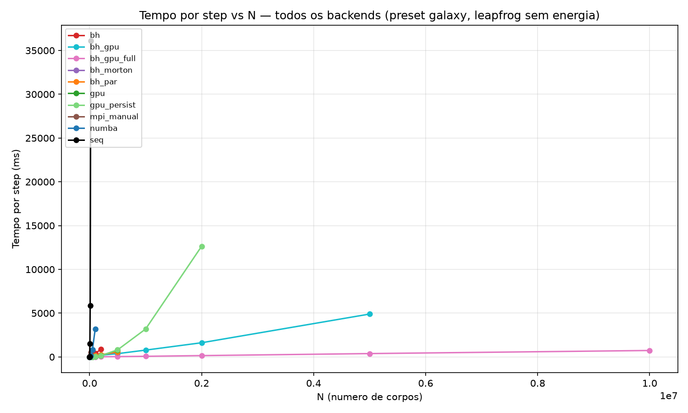

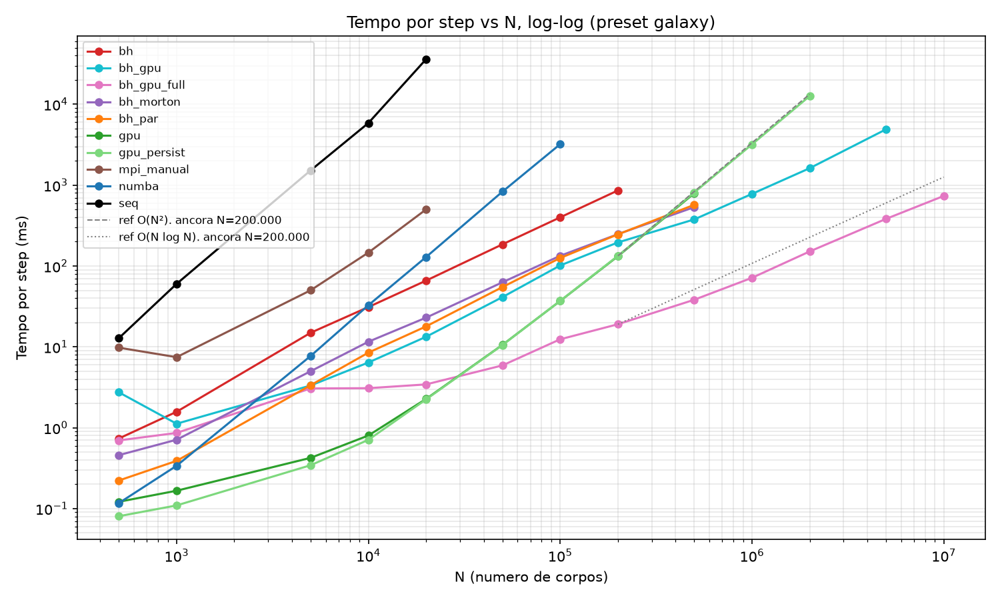

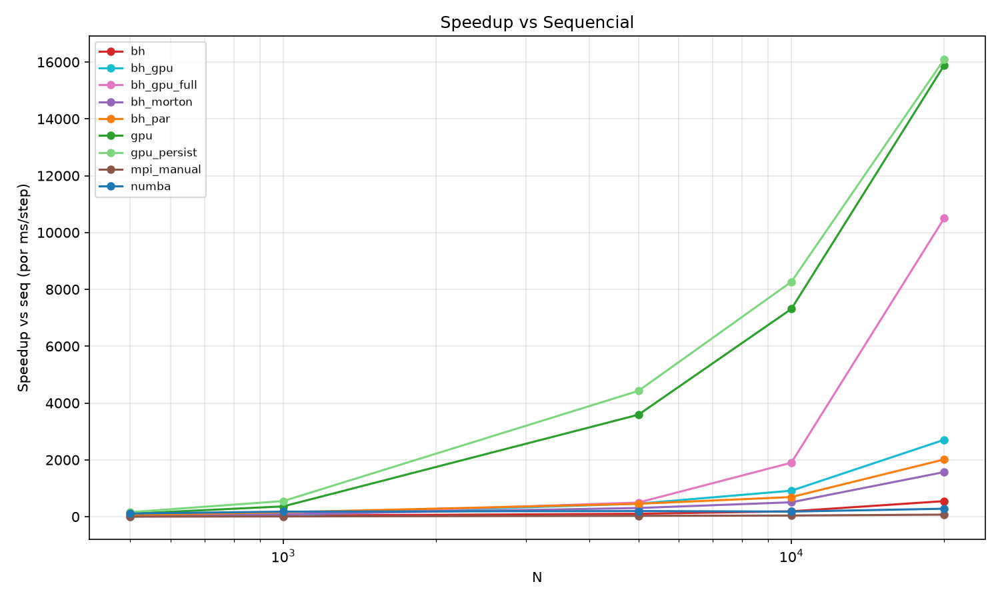

*Observação: apenas os N medidos no backend sequencial (N ≤ 20000) entram neste gráfico — speedups fora dessa faixa não são definidos, pois o `seq` não foi executado acima de 20000 (teto viável, §11).*

**Comparativo direto N² vs. Barnes-Hut (o crossover).** `scripts/benchmark_gpu_vs_bh.py` leva força bruta (`gpu_persist`) e as duas variantes BH (`bh_gpu`, `bh_gpu_full`) na mesma grade de N até cada muro (`benchmark_results/gpu_vs_bh_20261001_134501.json`, 500 a 10M), com inclinações de referência e linha de crossover calculada por interpolação log-log:

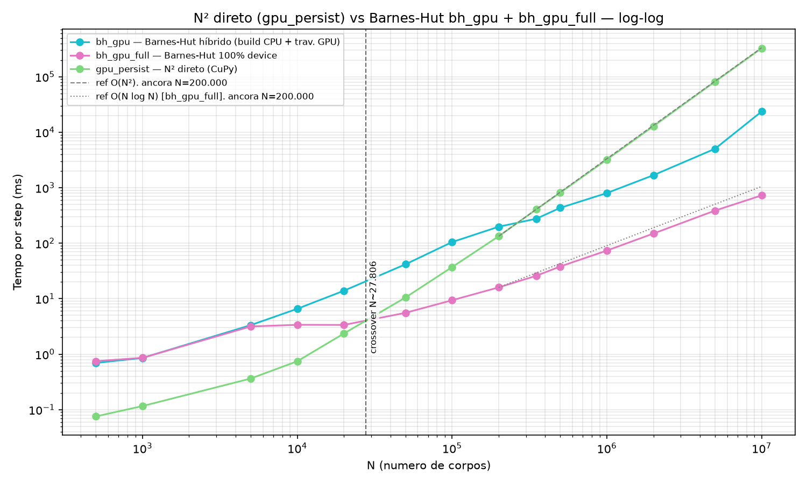

### 12.4 Análise

- **Força bruta em GPU (`gpu_persist`) domina em termos absolutos** em todo o intervalo comparável (500–20000), o backend mais rápido para cada N individualmente, com *speedup* crescente até **~16100×** em N=20000 — esperado: o problema é embaraçosamente paralelo em granularidade fina, e a GPU oferece ordens de grandeza mais unidades de execução simultâneas que a CPU. A variante com buffers persistentes vence a com realocação por passo em todos os N (ex. 2,24 vs. 2,27 ms em 20k).
- **`bh_par` × `bh_gpu`: há um crossover interno em N≈5000** (0,22 vs. 2,74 ms em 500 a favor do paralelo-CPU; empate técnico em 5000, 3,36 vs. 3,33 ms; híbrido-GPU vence de 10k em diante, 6,41 vs. 8,49 ms) — corrigindo a afirmação anterior deste documento, que dava `bh_par` como vencedor em todo o intervalo: a releitura dos dados mostra que ela só valia até ~5k. Abaixo disso, o custo fixo de transferência CPU↔GPU da árvore supera o ganho do percurso na GPU; acima, o percurso GPU compensa. Coerente com §12.5.
- **`mpi_manual` tem o menor *speedup* entre os backends paralelos** em todo o intervalo — coerente com §5.2: o custo de comunicação de rede real (LAN, não *loopback*, entre um master de 28 threads e um worker de 8 threads de hardware de 2009) não desaparece com o aumento de N tão rapidamente quanto sincronização de memória compartilhada (Numba) ou PCIe (GPU); ainda assim, o *speedup* cresce monotonicamente com N (1,31× → 72,05×), confirmando que a fração dominada pela computação aumenta com N, como previsto em §2.4.
- **A anomalia JIT de N=500 desapareceu — e isso também é resultado.** Na suíte anterior, o Numba media 29,83 ms em N=500 (*speedup* 0,44×, mais lento que o sequencial); na metodologia atual (warmup explícito fora do cronômetro + sem energia no laço), o mesmo ponto mede 0,12 ms (*speedup* 109,64×). A "anomalia" era artefato de medição fria + contaminação por energia, não propriedade do backend — antes/depois documentado. A lição metodológica permanece (benchmarks JIT devem separar medição fria de quente), agora demonstrada nos dois sentidos.
- **As complexidades aparecem nos dados, não só na teoria.** No log-log geral, `seq`/`numba`/`gpu`/`gpu_persist` sobem ~4× a cada dobra de N (assinatura O(N²): ex. `gpu_persist` 37,06 → 133,52 de 100k a 200k, ×3,6; 133,52 → 810,66 até 500k, ×6,07 para ×2,5 N contra ×6,25 teóricos), enquanto `bh`/`bh_par`/`bh_morton` sobem ~2,1× (O(N log N): ex. `bh` 185,31 → 399,75 → 859,85 de 50k a 200k). As referências do gráfico partem do mesmo N (âncora em 200k, declarada na legenda — regra única nos dois scripts): a O(N²) acerta `gpu_persist` em 10M a 2,4%, e a O(N log N) vira limite superior do `bh_gpu_full` acima de ~1M (efeito de ocupação da GPU, detalhado em §12.5).

### 12.5 Quando Barnes-Hut vence o método direto: comparativo a três

O crossover foi medido a três — força bruta (`gpu_persist`), Barnes-Hut híbrido (`bh_gpu`, build CPU + traversal GPU) e Barnes-Hut 100% em GPU (`bh_gpu_full`, build no device) — na mesma grade de N, do comparável ao muro de cada um (`benchmark_results/gpu_vs_bh_20261001_134501.json`, preset `galaxy`, 500 a 10M corpos; pontos de 10M para `gpu_persist`/`bh_gpu` são probes de parede de tempo, 1–2 passos, mesma metodologia):

| N | `gpu_persist` (N²) | `bh_gpu` (híbrido) | `bh_gpu_full` (device, pós-fusão ×2) | Vencedor |
|---|---:|---:|---:|---|
| 20 000 | 2,35 | 13,89 | 3,36 | N² direto |
| 50 000 | 10,49 | 41,58 | 5,55 | **BH device** |
| 100 000 | 37,00 | 104,58 | 9,35 | **BH device** |
| 200 000 | 133,09 | 197,80 | 15,95 | **BH device** |
| 350 000 | 405,33 | 275,73 | 25,83 | **BH device** (11–16×) |
| 500 000 | 814,31 | 433,18 | 38,02 | **BH device** (11–21×) |
| 1 000 000 | 3211,82 | 799,84 | 73,49 | **BH device** (11–44×) |
| 2 000 000 | 12825,50 | 1679,89 | 149,13 | **BH device** (11–86×) |
| 5 000 000 | 81494,76 | 5027,28 | 386,45 | **BH device** (13–211×) |
| 10 000 000 | 325011,97\* | 23546,14\* | 725,55 | **BH device** (**448×** sobre o N², 32× sobre o híbrido) |

*\* Probes de 1–2 passos (`probe_limits.json`): o N² em 10M custa 325 s/passo (5,4 min) — a hipótese de que seria impraticável foi testada, não presumida; por O(N²), 20M custaria ~22 min/passo.*


Leitura crítica do gráfico (as três inclinações contam três histórias):

- **`gpu_persist` (verde): colado na referência O(N²)** — a linha tracejada, ancorada no ponto medido em N=200k e projetada por N² puro, acerta o ponto de 10M em 2,4% (332.725 previsto vs. 325.012 medido, duas décadas de projeção): imbatível abaixo de ~28k pela força bruta dos 4352 núcleos CUDA num problema embaraçosamente paralelo, impraticável acima de ~2M.
- **`bh_gpu_full` (rosa): patamar quase plano (~3–38 ms) de 5k até ~500k** — nessa faixa o custo é dominado pelo preço fixo do build (~60 micro-operações de lançamento após as duas fusões documentadas em §7.2, contra ~600 antes — o patamar era ~40 ms), não pelo N; cruza o N² em **N≈27.806** (linha vertical calculada por interpolação log-log, não estimada a olho — era ~128k antes das fusões). Acima de ~1M, a curva rosa cresce *mais devagar* que a referência O(N log N) ancorada em 200k — a referência vira limite superior: com N grande a ocupação da GPU aumenta e o custo por corpo cai, um efeito de eficiência paralela que a fórmula O(N log N) pura não captura.
- **`bh_gpu` híbrido (azul): o meio-termo que nunca vence** — cruza o N² entre 200k e 350k, mas em todo o intervalo medido perde para um dos outros dois (paga o build em CPU *e* a transferência da árvore por passo, sem a economia do build no device nem a força bruta do N²). Conclusão honesta do grupo: no código atual, o híbrido só se justificaria sem runtime CUDA completo para o build; com CuPy funcional, ou se usa N² direto (N pequeno) ou o device completo (N grande).

Notas de rigor: (i) o ponto `bh_gpu_full` em 10M varia com o estado do pool de memória: 340 ms em processo fresco dedicado contra ~726 ms na sequência ascendente da suíte (blocos de N menores fragmentam o pool — teto conservador, mesma condição dos demais backends); uma medição com a GPU ainda quente/fragmentada após 4 min de burn N² deu 3916 ms e foi descartada e documentada no JSON — estado do acelerador e do pool também são variáveis experimentais; (ii) todos os plots do trabalho usam a mesma cor por backend e os títulos são gerados a partir dos backends efetivamente medidos (nunca hardcodados — foi assim que se corrigiu o plot antigo que dizia "gpu_persist vs bh_gpu" sobre dados só de `bh_gpu_full`).

Para o intervalo de N solicitado neste trabalho (500 a 20000), a força bruta na GPU (`gpu_persist`) permanece o backend mais rápido em termos absolutos (§12) — o que é coerente com a análise teórica original do grupo, registrada em `docs/BARNES_HUT.md`: *"Com RTX 4060 Ti: gpu direto ainda ganha até N~50000 (...). BH só vence acima de ~100k."* (a medição final situou o cruzamento N²×device em ~28k — ~128k antes das fusões de kernels — e o N²×híbrido em 200–350k).

### 12.6 Teto de escala: quando acaba a VRAM (20M corpos)

Estendendo só o `bh_gpu_full` (`benchmark_results/gpu_vs_bh_20260908_134332.json`):

| N | `bh_gpu_full` ms/passo (código pós-fusões) |
|---|---:|
| 10 000 000 | 343,34 (grade 500–10M re-medida com 1 processo fresco por N — metodologia uniforme; 726 na sequência ascendente com pool fragmentado, ver nota (i) em §12.5) |
| 20 000 000 | 16884,53 (código pós-fusões, processo fresco, 2 trials 14,1/19,7 s — variância alta típica de swap; o limite teórico single-device) |

Até 10M a curva segue O(N log N) (~2× a cada dobra de N); em 20M o tempo salta **~49×** — a VRAM de 8 GB esgota e fica estourada durante todo o run, com o driver passando a alocar em **memória compartilhada do sistema** (swap PCIe, observado diretamente no gerenciador durante a execução), como mostra a captura da execução anterior (GPU dedicada 7,6/8,0 GB lotada, compartilhada 3,2/15,9 GB em uso, RAM do sistema 23,3/31,8 GB):


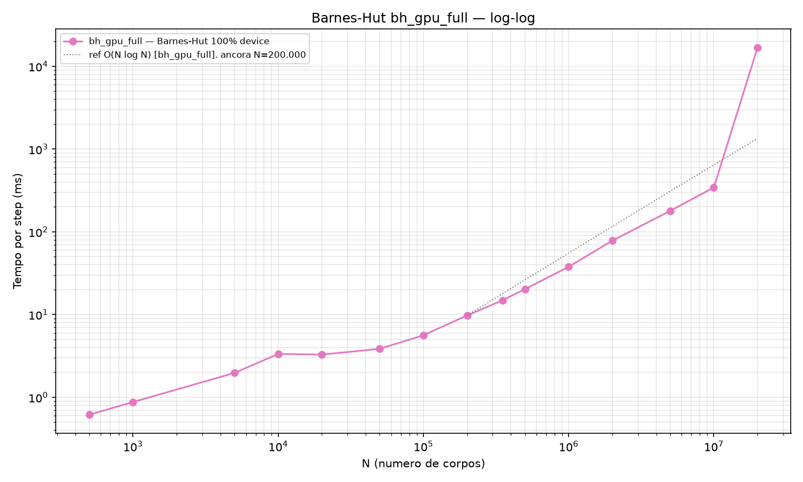

Ou seja: nesta RTX 4060 Ti de 8 GB, o teto prático fica entre 10M e 20M de corpos — acima de ~1M por passo o gargalo deixa de ser aritmética e passa a ser memória (primeiro VRAM, depois banda PCIe). Para o escopo deste trabalho (≤20k no comparativo principal), esse regime nunca é atingido — ele está documentado aqui como limite físico medido, não como cenário de uso.

---

## 13. Conservação de Energia entre Integradores

Complementando a comparação teórica de §2.2, o grupo gerou comparações de conservação de energia entre os integradores Euler e Leapfrog para 9 dos presets do projeto (`scripts/compare_integrators.py`, saída em `data_final/`), executando cada preset com ambos os integradores sob os mesmos parâmetros (`N`, `dt`, `eps`, semente) e plotando o drift relativo de energia `|E(t)-E(0)|/|E(0)|` em escala logarítmica ao longo dos passos, além da energia total absoluta:

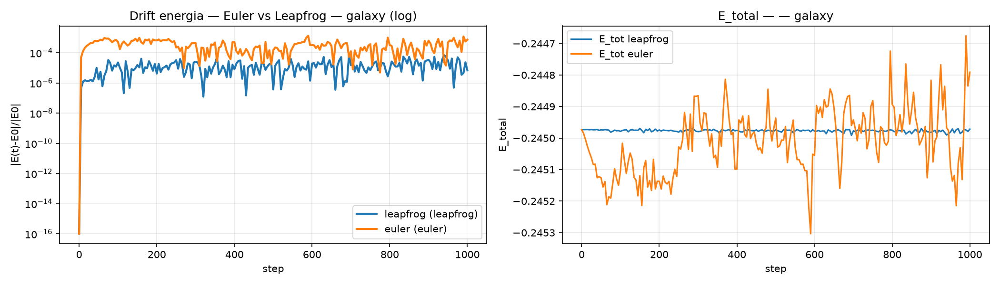
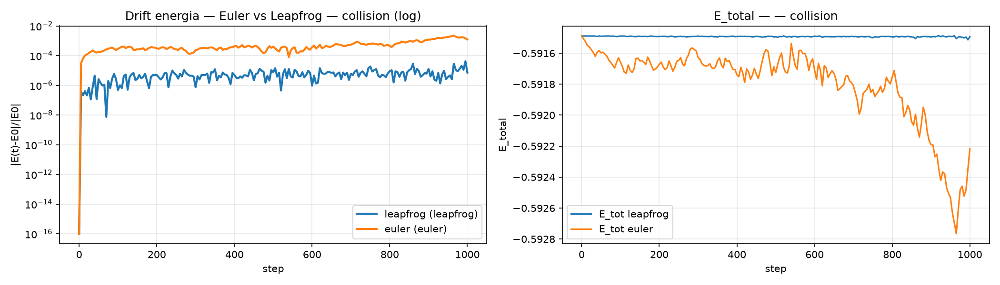
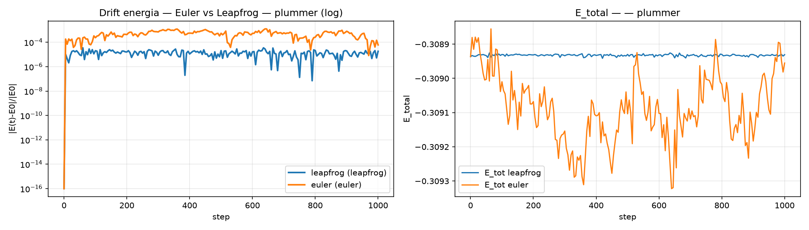
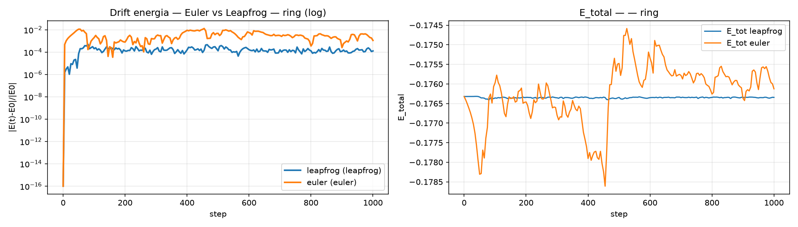
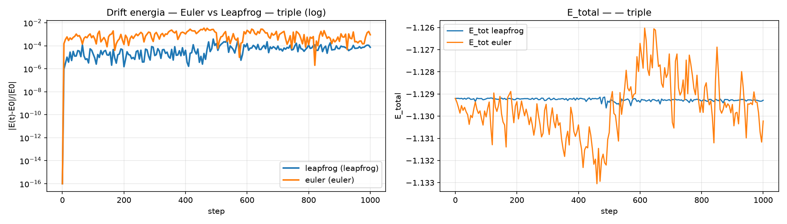
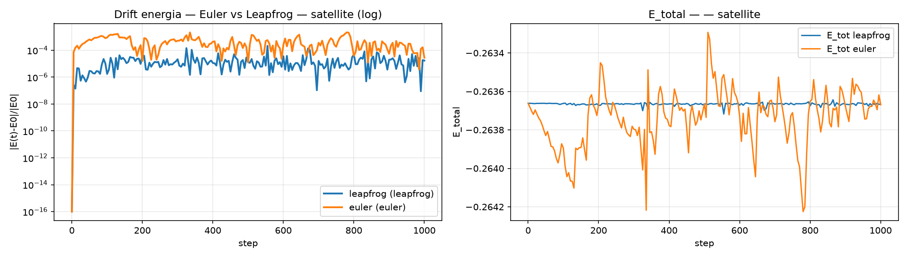
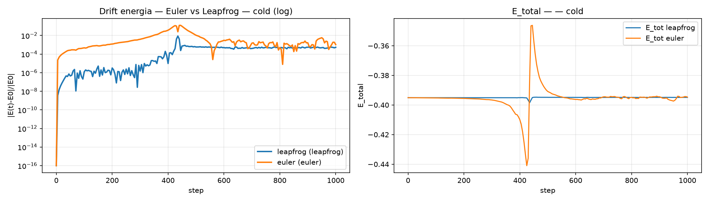
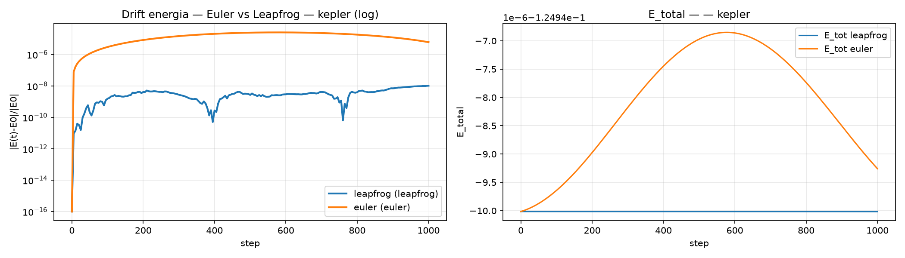
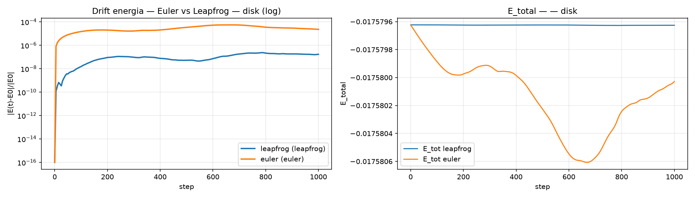

Em todos os presets analisados, o padrão teórico descrito em §2.2 se confirma visualmente: o drift de energia do Leapfrog permanece **limitado (oscilante em torno de um valor pequeno)** ao longo de toda a simulação, enquanto o do Euler semi-implícito cresce de forma sistemática — a diferença sendo tipicamente de várias ordens de grandeza no drift final, consistente com a medição numérica direta reportada em §2.2 (2,413×10⁻⁷ Leapfrog vs. 2,193×10⁻⁴ Euler, para o caso de teste controlado N=128).

---

## 14. Testes e Validação

`tests/test_sequential.py` implementa seis testes automatizados de corretude física e numérica sobre a implementação de referência (o núcleo do qual todos os demais backends derivam). Esses testes foram **executados neste momento**, diretamente contra o código do repositório, para esta documentação (ambiente Python 3, NumPy 2.2.6, sem `pytest` disponível no ambiente de verificação — os testes foram invocados diretamente como funções Python):

| Teste | O que valida | Resultado |
|---|---|---|
| `test_forces_vs_reference` | Força vetorizada (NumPy *broadcasting*) produz o mesmo resultado que o laço de referência ingênuo, com tolerância `1×10⁻¹²` | **PASSOU** |
| `test_tiled_vs_vec` | Versão em blocos (*tiled*, para N grande) produz resultado idêntico à vetorização completa, para múltiplos tamanhos de bloco (7, 16, 32, 64), tolerância `1×10⁻¹¹` | **PASSOU** |
| `test_energy_tiled` | Cálculo de energia total em blocos coincide com o cálculo direto, tolerância `1×10⁻⁹` | **PASSOU** |
| `test_momentum_conservation` | O momento linear total do sistema permanece nulo (por construção da condição inicial e simetria da 3ª Lei de Newton) após 10 passos de Leapfrog | **PASSOU** |
| `test_energy_drift_leapfrog` | O drift de energia do Leapfrog é inferior a 1% em 200 passos (`N=128`, `dt=10⁻⁴`) | **PASSOU** (drift medido: 2,41×10⁻⁷, muito abaixo do limiar de 1%) |
| `test_two_body_circular` | Uma órbita circular de dois corpos mantém a distância entre eles aproximadamente constante (variação < 5%) após 100 passos de Leapfrog | **PASSOU** |

Este conjunto de testes valida a corretude do **núcleo físico compartilhado** por todos os backends (força vetorizada, energia, integrador Leapfrog); a corretude específica dos kernels paralelos (Numba, MPI, GPU, Barnes-Hut) frente a esse núcleo é validada por comparação direta de acelerações entre backends nos próprios scripts de execução — por exemplo, `nbody_mpi_manual.py` (bloco `__main__`) compara explicitamente a aceleração calculada via MPI manual contra a versão sequencial `tiled` (`err = max|a_ref - a_mpi|`, critério de aceite `< 10⁻⁹`) antes de rodar qualquer simulação distribuída completa.

---

## 15. Conclusões e Mapeamento aos Critérios de Avaliação

| Critério do enunciado | Onde está atendido neste projeto |
|---|---|
| Modelagem e estratégia (2,0) | §2 — força com softening de Plummer, dois integradores comparados e medidos, decomposição por partículas justificada teórica e experimentalmente |
| Threads/OpenMP — memória compartilhada (2,0) | §4 — Numba `@njit(parallel=True)`/`prange`, explicação da cadeia de compilação (Python→Numba IR→LLVM IR→nativo), *speedup* de até ~279× medido (N=20000) |
| MPI — memória distribuída (2,0) | §5 — implementação `mpi4py` padrão **e** implementação real em cluster físico heterogêneo (sockets TCP persistentes), com balanceamento de carga proporcional à capacidade heterogênea de cada nó, executada em hardware real (não simulação de MPI em uma única máquina) |
| GPU (1,0) | §6 — CuPy `RawKernel` (CUDA C manual) em RTX 4060 Ti, com variante de buffers persistentes; *speedup* de até ~16100× medido (N=20000) |
| Análise de desempenho (1,5) | §11–§12 — suíte de benchmark automatizada e reprodutível, 10 backends com N até o teto viável de cada um (500–10M), tempo total e por passo, gráficos comparativos padronizados com referências O(N²)/O(N log N), análise crítica de anomalias reais (warm-up JIT antes/depois, crossover N²×BH anotado) |
| Documentação (1,5) | Este documento — modelagem, arquitetura, decisões de projeto justificadas (por que Numba, por que CuPy RawKernel, por que VisPy, por que sockets TCP em vez de SSH), limitações declaradas explicitamente |

Além do exigido, o projeto demonstra: (i) um algoritmo hierárquico O(N log N) completo (Barnes-Hut, §7) em seis variantes, com análise de crossover medida experimentalmente (não apenas estimada) contra a força bruta em GPU; (ii) execução real — não simulada — em um cluster heterogêneo com hardware de gerações distintas (2009 e 2026); (iii) integração com uma fonte de dados científicos real e externa (NASA JPL Horizons, §10), com análise honesta de suas limitações de robustez (parsing de texto, rate limiting, cobertura parcial); (iv) **validação do modelo contra a realidade observável** (§10.6): propagação janeiro→setembro/2026 confrontada com efemérides independentes da mesma data e com as luas cheias do ano, incluindo referência de precisão (IAS15) para separar erro de integrador de erro de modelo; (v) ingestão em massa de 1,5 milhão de corpos reais sem API (MPCORB, §10.7), com tratamento explícito de épocas mistas e massas desconhecidas.

**Limitações gerais do projeto, declaradas para transparência acadêmica:**

- O *build* paralelo por octante do Barnes-Hut (`build_octree_mp`) é uma demonstração de conceito de paralelismo na fase de construção da árvore, ainda não integrada ao caminho de produção (retorna a árvore serial para o cálculo de força, conforme documentado em §7.2).
- A implementação MPI padrão (`mpi4py`) não foi exercitada em cluster real neste conjunto de benchmarks (por incompatibilidade de MS-MPI/OpenMPI entre os sistemas operacionais disponíveis ao grupo); a variante MPI manual por sockets TCP foi a usada para os resultados de memória distribuída reportados em §12, sendo funcionalmente equivalente em termos de padrão de comunicação (decomposição 1-D + coleta coletiva por passo).
- Como próximo passo natural para escalar além de dezenas de milhões de partículas, o método de **Fast Multipole Method (FMM)**, O(N), foi identificado (mas não implementado) como sucessor natural do Barnes-Hut, conforme registrado em `docs/BARNES_HUT.md`.

---

## 16. Referências

- Aarseth, S. J.; Henon, M.; Wielen, R. (1974). *Numerical methods for the study of star cluster dynamics*. Astronomy and Astrophysics, 37, 183–187. — base da amostragem de velocidades da esfera de Plummer implementada em `src/presets.py`.
- Barnes, J.; Hut, P. (1986). *A hierarchical O(N log N) force-calculation algorithm*. Nature, 324, 446–449. — algoritmo base da implementação Barnes-Hut (§7).
- JPL Solar System Dynamics — Horizons System API. Jet Propulsion Laboratory, NASA/Caltech. `https://ssd.jpl.nasa.gov/horizons/` — fonte dos vetores de estado e GMs reais usados em §10.
- Minor Planet Center — *Export Format for Minor-Planet Orbits* e *Packed Dates*. `https://minorplanetcenter.net/iau/info/MPOrbitFormat.html` — especificação do formato fixo do catálogo MPCORB consumido em §10.7 (colunas, época packed, elementos heliocêntricos J2000).
- Rein, H.; Liu, S.-F. (2012). *REBOUND: An open-source multi-purpose N-body code for collisional dynamics*. Astronomy & Astrophysics, 537, A128. — integrador IAS15 usado como referência de precisão na validação lunar (§10.6).
- LLVM Project — *The LLVM Compiler Infrastructure*. `https://llvm.org/` — infraestrutura de compilação usada internamente pelo Numba (§4.2).
- Documentação interna do projeto: `README.md`, `GPU_README.md`, `docs/BARNES_HUT.md` — registros de decisões de projeto e diagnósticos de ambiente produzidos ao longo do desenvolvimento, usados como fonte primária para este documento.
- Repositório do projeto (código-fonte completo, este documento incluído): `src/`, `scripts/`, `benchmark_results/`, `data_final/`, `docs/`.

---

*Documento gerado a partir de código-fonte, resultados de benchmark e execuções de teste reais do repositório do projeto. Todas as métricas numéricas citadas (tempos de execução, drift de energia, taxa de sucesso da API da NASA, resultados de testes) foram extraídas diretamente de arquivos de saída do projeto (`benchmark_results/*.json`, `data/horizons_cache.json`, `fetch.log`) ou de execuções realizadas durante a elaboração deste documento — nenhum valor foi estimado.*